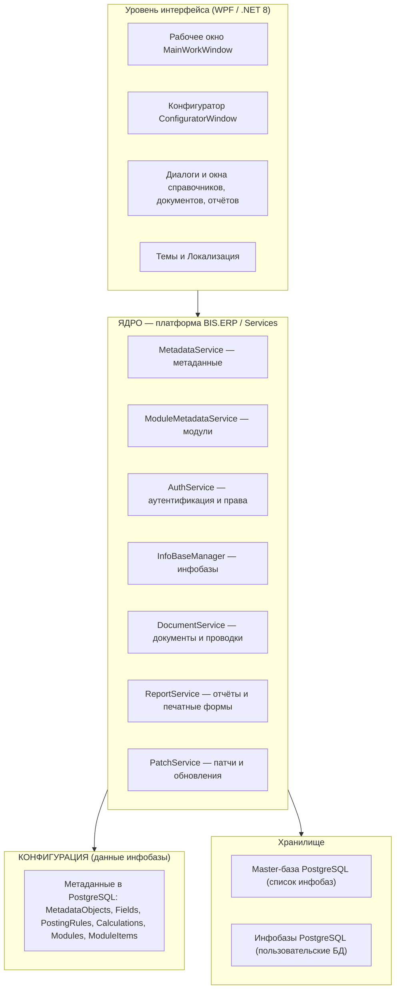
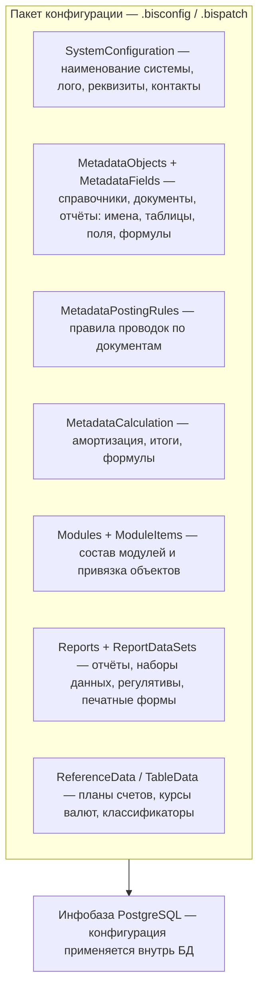
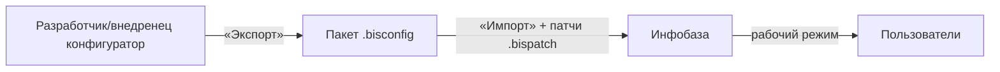
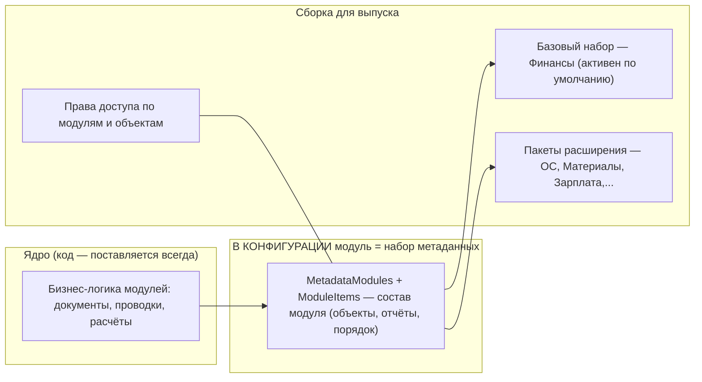
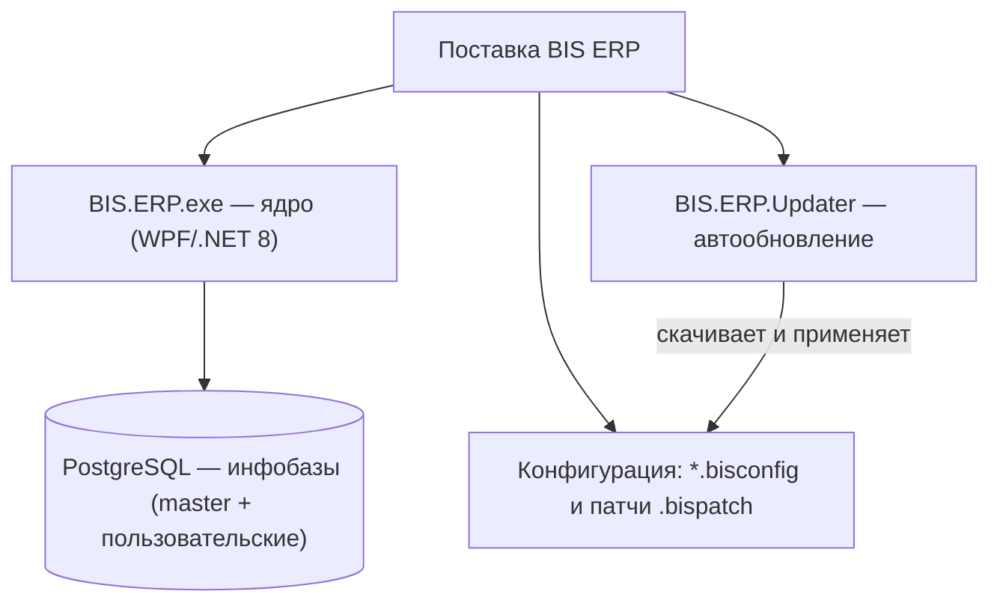

# BIS ERP — Архитектура выпускаемой системы

> [!NOTE] Как смотреть в Obsidian
> Открой заметку в **режиме чтения** (иконка «глаз» или `Ctrl+E`).
> Если в режиме редактирования таблицы выглядят как текст — включи `Настройки → Редактор → Живой предпросмотр (Live Preview)`.
> Таблицы здесь сделаны в HTML-формате, поэтому отображаются как сетка в любом режиме чтения.

> Дата актуализации: сентябрь 2026
> Назначение документа: единая визуальная схема архитектуры BIS ERP — ядро, конфигурация инфобазы, модули и поставка.

---

## 1. Общий стек (3 уровня)

---

## 2. Ядро — что выполняет, какие сервисы и зачем

Ядро — единственный поставляемый слой кода. Все функции ядра работают **только через метаданные** из конфигурации инфобазы.

<table>
<thead>
<tr><th>Блок ядра</th><th>Ключевые сервисы</th><th>Функции</th></tr>
</thead>
<tbody>
<tr><td>Управление инфобазами</td><td><code>InfoBaseManager</code></td><td>создание/подключение БД, выбор базы, логотипы, версии патчей</td></tr>
<tr><td>Безопасность</td><td><code>AuthService</code>, <code>UserAccessService</code>, <code>UserRoleIntegrityService</code></td><td>вход, хэш BCrypt, права по объектам и модулям</td></tr>
<tr><td>Метаданные</td><td><code>MetadataService.*</code>, <code>RuntimeSchemaFixService</code></td><td>описание объектов/полей/проводок/расчётов; автоподстройка схемы БД</td></tr>
<tr><td>Модули</td><td><code>ModuleMetadataService</code></td><td>реестр модулей, активность, порядок закрытия, привязка объектов</td></tr>
<tr><td>Документы и проводки</td><td><code>DocumentService</code>, <code>PostingService</code>, <code>BalanceService</code></td><td>проведение, единый журнал проводок, итоги, закрытие периода</td></tr>
<tr><td>Отчёты</td><td><code>ReportService</code>, <code>PrintFormService</code>, <code>FrxToReportConverter</code></td><td>конструктор отчётов, печатные формы, PDF/Excel</td></tr>
<tr><td>Обновление</td><td><code>BisPatchService</code>, <code>AppUpdatePackageService</code>, <code>BIS.ERP.Updater</code></td><td>версионирование инфобазы, зашифрованные пакеты, автообновление</td></tr>
<tr><td>Интеграция данных</td><td><code>DbfParserService</code>, <code>FrxParser</code>, <code>ClosedXML</code></td><td>импорт данных на старте и обмене</td></tr>
</tbody>
</table>

---

## 3. Конфигурация — что она несёт

Конфигурация — **не код**, а данные внутри каждой инфобазы. Выпуск = ядро + одна или несколько конфигураций («платформа пуста — конфигурация предметна»).

**Что приносит конфигурация:**

- **Предметная область**: какие справочники, документы и отчёты есть у организации.
- **Логика учёта**: план счетов, правила проводок, порядок закрытия модулей.
- **Состав модулей**: какие модули для инфобазы (Финансы — да, ОС — нет…).
- **Печать/экспорт**: макеты печатных форм, отчётные наборы данных.

**Механика поставки конфигурации**

---

## 4. Модули — как устроены и как выпускаются

Модуль — **не отдельная программа**, а раздел конфигурации (набор объектов метаданных) + бизнес-логика в ядре. Выпуск подключает нужные модули через конфигурацию и права доступа.

### Статусы модулей (движение к выпуску)

<table>
<thead>
<tr><th>Код</th><th>Модуль</th><th>Статус (авг 2026)</th><th>CloseOrder</th></tr>
</thead>
<tbody>
<tr><td><code>Finance</code></td><td>Финансы</td><td>✅ Production, активен по умолчанию</td><td>900</td></tr>
<tr><td><code>Balance</code></td><td>Баланс (итоговое закрытие)</td><td>⚙️ служебный этап</td><td>10000</td></tr>
<tr><td><code>FixedAssets</code></td><td>Основные средства</td><td>🧪 метаданные + логика + smoke-тесты, UI — сент. 2026</td><td>200</td></tr>
<tr><td><code>Inventory</code></td><td>Материалы</td><td>🧪 метаданные + тесты</td><td>300</td></tr>
<tr><td><code>Payroll</code></td><td>Зарплата</td><td>⏳ план Q4 2026</td><td>400</td></tr>
<tr><td><code>Sales</code></td><td>Сбыт</td><td>⏳ план Q1 2027</td><td>500</td></tr>
<tr><td><code>RawMaterials</code></td><td>Сырьё</td><td>⏳ план 2027</td><td>600</td></tr>
<tr><td><code>CostAccounting</code></td><td>Себестоимость</td><td>⏳ план 2027</td><td>700</td></tr>
</tbody>
</table>

**Этапы жизни модуля (одинаковы для всех):**

1. Метаданные (справочники, документы, поля, проводки, отчёты)
2. Бизнес-логика (проведение, расчёты, движения)
3. UI модуля (окна, диалоги)
4. Период закрытия (сбор, снимки, проверки сбалансированности)
5. Тесты (smoke + строгие числовые проверки)

---

## 5. Поставка и исполняемые артефакты

---

## 6. Итоговые артефакты выпуска

<table>
<thead>
<tr><th>Артефакт</th><th>Что это</th><th>Источник</th></tr>
</thead>
<tbody>
<tr><td>Ядро</td><td>единственная исполняемая программа</td><td><code>BIS.ERP.exe</code></td></tr>
<tr><td>Конфигурация</td><td>метаданные + данные, переносится между БД</td><td><code>.bisconfig</code></td></tr>
<tr><td>Патчи</td><td>обновления логики/данных инфобазы</td><td><code>.bispatch</code></td></tr>
<tr><td>Обновлятель</td><td>отдельный процесс автообновления</td><td><code>BIS.ERP.Updater</code></td></tr>
<tr><td>Модули</td><td>набор объектов внутри конфигурации</td><td><code>MetadataModule</code>, <code>MetadataModuleItem</code></td></tr>
<tr><td>Инфобазы</td><td>пользовательские БД PostgreSQL</td><td>сервер организации</td></tr>
<tr><td>Тесты</td><td>контур проверки валидности</td><td><code>BIS.ERP.TESTS</code> (unit/UI)</td></tr>
</tbody>
</table>