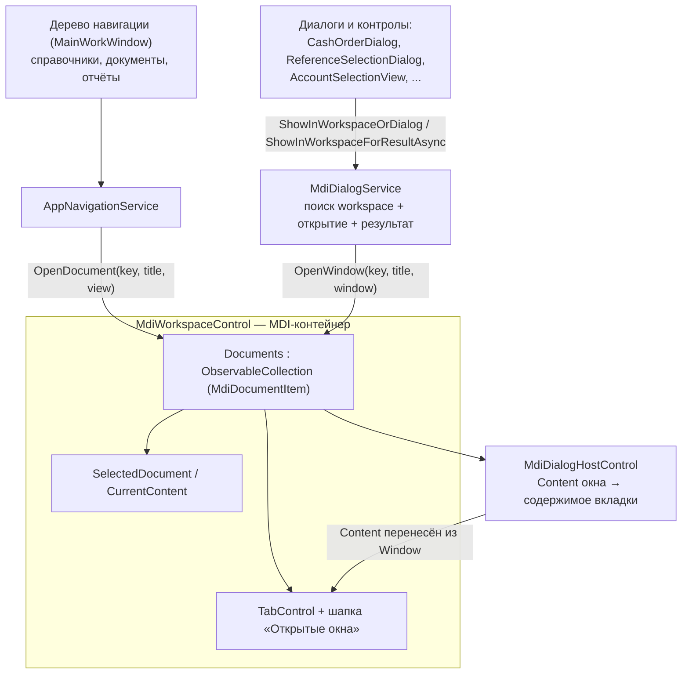
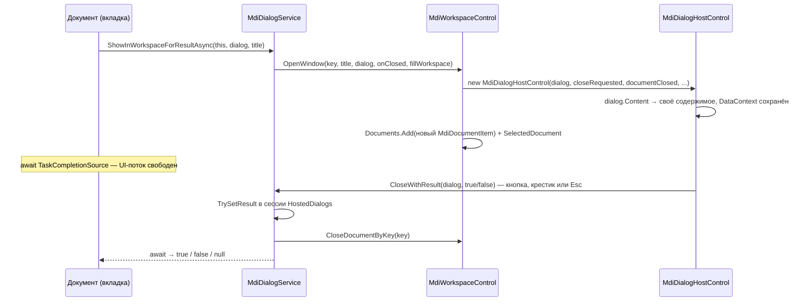

# BIS ERP — технология MDI: принципы и обоснование применения

Дата актуализации: 21.09.2026

Документ объясняет, что такое MDI (Multiple Document Interface), как эта технология реализована
в BIS ERP (WPF / .NET 8) и почему для рабочего места пользователя и конфигуратора выбран именно
такой вариант организации интерфейса.

Документ дополняет:

- `ARCHITECTURE.md` — общая архитектура системы (ядро, конфигурация, модули);
- `PROJECT_SCHEMA.md` — структура кода и ключевые файлы;
- `ROADMAP.md` — планы развития модулей и UI.

---

## 1. Теоретическая часть: что такое MDI

### 1.1 Определение

**MDI (Multiple Document Interface, многооконный интерфейс документов)** — способ построения
графического интерфейса, при котором одно «родительское» окно приложения содержит внутри своей
клиентской области несколько «дочерних» окон-документов. Дочерние окна живут **внутри** родителя:
их нельзя перетащить за пределы его клиентской области, они сворачиваются/разворачиваются в её
границах, а сама операционная система не показывает их отдельными кнопками на панели задач.

Термин и сама модель появились в конце 1980-х (Microsoft Excel 2.0, 1987) и были закреплены в
Windows API как «MDI» в Windows 3.0: стиль `WS_EX_MDICHILD`, сообщения `WM_MDICREATE`,
`WM_MDIDESTROY`, `WM_MDIACTIVATE`, `WM_MDITILE`, `WM_MDICASCADE`, `WM_MDIARRANGEICONS`
и клиентское окно-контейнер `MDIClient`.

Ключевые понятия MDI:

| Понятие | Смысл |
|---|---|
| Родительское окно (MDI parent / shell) | Единственное окно приложения, владеющее областью документов |
| Дочернее окно (MDI child / документ) | Окно одного документа (справочник, карточка, отчёт) |
| Активный документ | Документ, который сейчас получает ввод; в каждый момент он один |
| Реестр документов | Список открытых документов и правило дедупликации (один документ — один экземпляр) |
| Раскладка (layout) | Правило расположения дочерних окон: каскад, плитка по горизонтали/вертикали |

### 1.2 Три модели организации интерфейса

<table>
<thead>
<tr><th>Модель</th><th>Суть</th><th>Примеры</th><th>Особенности</th></tr>
</thead>
<tbody>
<tr><td><b>SDI</b><br/>Single Document Interface</td><td>Один документ — одно окно ОС</td><td>Word 2013+, Photoshop, «Блокнот»</td><td>Простая реализация; при 5–10 документах пользователь получает 5–10 окон и вынужден искать нужное среди них</td></tr>
<tr><td><b>MDI (классический)</b></td><td>Несколько дочерних окон внутри одного родительского</td><td>Excel (до 2013), Visual Studio 6, старые WinForms-приложения</td><td>Единая сессия и «шапка», но окна перекрывают друг друга; каскад/плитка быстро становятся нечитаемыми</td></tr>
<tr><td><b>TDI / Tabbed MDI</b><br/>документы во вкладках</td><td>Несколько документов внутри одного окна, переключение вкладками</td><td>Visual Studio, Chrome, Notepad++, 1С:Предприятие</td><td>Современная замена классического MDI: та же идея «одна сессия — много документов», но без перекрывающихся окон</td></tr>
</tbody>
</table>

### 1.3 Классический MDI в .NET (WinForms) — для сравнения

Историческая (и самая «канонная») реализация MDI в платформе .NET находится в Windows Forms
и выглядит так:

```csharp
// WinForms: классический MDI
var parent = new Form { IsMdiContainer = true };

var child = new Form { MdiParent = parent, Text = "Документ" };
child.Show();                       // документ попадает внутрь клиентской области родителя
parent.LayoutMdi(MdiLayout.Cascade); // раскладка: Cascade / TileHorizontal / TileVertical
parent.ActiveMdiChild?.Close();      // закрыть активный документ
foreach (Form f in parent.MdiChildren) { /* список открытых документов */ }
```

Здесь работают свойства `IsMdiContainer`, `MdiParent`, `MdiChildren`, `ActiveMdiChild`,
метод `LayoutMdi` и коллекция дочерних окон самого контейнера. Именно эту модель обычно
подразумевают под словами «приложение с MDI».

### 1.4 Сильные и слабые стороны классического MDI

**Что даёт MDI:**

1. Единая сессия работы: пользователь не теряет контекст между документами.
2. Один вход в систему, один набор прав, один набор справочников в памяти.
3. Экономия ресурсов ОС: одна запись на панели задач вместо десятка.
4. Быстрое переключение между документами без «Alt+Tab по всему рабочему столу».

**Ограничения и известные проблемы:**

1. Только одна область документов и один уровень вложенности — нельзя нормально разложить
   документы рядом («плитка» при 6+ окнах становится нечитаемой).
2. Окна перекрываются; пользователь постоянно двигает и ищет их.
3. Плохая совместимость с современными темами, DPI-масштабированием и эффектами окон.
4. Разработчик обязан вручную управлять «шапками» дочерних окон и их активацией.

Именно из-за этих проблем крупные продукты (Microsoft Office начиная с 2013, Visual Studio)
перешли от перекрывающихся дочерних окон к **вкладкам и пристыковываемым панелям** —
то есть к TDI-разновидности MDI. Вывод, важный для нашего проекта: **идея MDI (единое окно,
много документов, один реестр документов) остаётся рабочей, а вот конкретная реализация через
перекрывающиеся дочерние окна — устарела.**

---

## 2. MDI в WPF: почему «из коробки» его нет

BIS ERP построен на **WPF**, а WPF не содержит встроенной поддержки MDI:

- `System.Windows.Window` — самостоятельное **окно верхнего уровня** (HWND). Его нельзя сделать
  дочерним элементом другого окна: у `Window` нет свойств уровня `MdiParent`/`IsMdiContainer`,
  а «области документов» (`MDIClient`) в WPF-стеке не существует вообще.
- `Window.Content` принимает **один** корневой элемент. Значит, «много документов в одном окне»
  нужно строить самостоятельно: контейнер + коллекция + переключатель.

Отсюда три практических варианта организации «много документов в одном окне» в WPF:

<table>
<thead>
<tr><th>Вариант</th><th>Как делается</th><th>Плюсы</th><th>Минусы / почему не выбран</th></tr>
</thead>
<tbody>
<tr><td><b>1. Хостинг WinForms-контейнера</b></td><td><code>WindowsFormsHost</code> / <code>HwndHost</code> с <code>MdiClient</code> из WinForms</td><td>Формально «настоящий» MDI с каскадом и плиткой</td><td>Дочерние окна обязаны быть WinForms-формами (WPF-окна внутрь не поместить); проблемы с z-order, темами, DPI и перерисовкой; тяжёлый interop</td></tr>
<tr><td><b>2. Docking-библиотеки</b></td><td><code>AvalonDock</code> (<code>Dirkster.AvalonDock</code>), коммерческие <code>DevExpress</code> / <code>Telerik</code> / <code>Actipro</code></td><td>Готовые плавающие окна, пристыковка, сохранение раскладки</td><td>Внешняя зависимость в поставке, лицензии, объём и сложность; для задачи «открыть справочник / документ / отчёт» избыточно</td></tr>
<tr><td><b>3. Собственная эмуляция MDI на вкладках (TDI)</b> — <b>выбрано в BIS ERP</b></td><td><code>UserControl</code>-контейнер: <code>TabControl</code> + <code>ObservableCollection&lt;документ&gt;</code> + реестр по ключу + сервис открытия</td><td>Ноль внешних зависимостей; полный контроль над поведением и оформлением; легко расширяется (закрытие по Esc, перетаскивание вкладок, хостинг диалогов); всё в одном окне</td><td>Нет каскада/плитки и открепления вкладки в отдельное окно; раскладку нужно реализовывать самостоятельно, если она потребуется</td></tr>
</tbody>
</table>

Важно: вариант 3 — не «самодельный суррогат», а осознанная реализация **Tabbed MDI** —
той же модели, что используется в Visual Studio и 1С:Предприятие. Подсистема получила
проектные имена `Mdi*` именно для того, чтобы в коде было видно: это MDI-контейнер
(документы, реестр, активный документ, «закрыть все»), а не произвольный `TabControl`.

---

## 3. Как MDI реализован в BIS ERP

### 3.1 Состав подсистемы

<table>
<thead>
<tr><th>Артефакт</th><th>Роль в MDI</th></tr>
</thead>
<tbody>
<tr><td><code>Views/Controls/MdiWorkspaceControl.xaml(.cs)</code></td><td><b>Рабочее пространство (MDI-контейнер).</b> Держит коллекцию документов <code>Documents</code>, активный документ <code>SelectedDocument</code>, шапку «Открытые окна», кнопки «Закрыть» / «Закрыть все», пустое состояние, вкладки с крестиком, перетаскивание вкладок и закрытие активного документа по <code>Esc</code></td></tr>
<tr><td><code>MdiDocumentItem</code> (в том же файле)</td><td><b>Документ (вкладка).</b> Неизменяемая запись <code>Key</code> + <code>Title</code> + <code>Content</code> (<code>UserControl</code>)</td></tr>
<tr><td><code>Views/Controls/MdiDialogHostControl.cs</code></td><td><b>Адаптер окна в документ.</b> Забирает <code>Content</code> готового <code>Window</code>-диалога и показывает его внутри вкладки: режимы «карточка» (по центру, с рамкой и тенью) и <code>fillWorkspace</code> (на всю область)</td></tr>
<tr><td><code>Services/MdiDialogService.cs</code></td><td><b>Сервис открытия.</b> Находит подходящее рабочее пространство, открывает окна и контролы как документы, возвращает результат асинхронно, имеет <b>fallback</b> на обычные модальные окна</td></tr>
<tr><td><code>Services/AppNavigationService.cs</code></td><td><b>Навигация.</b> Превращает выбор в дереве объектов (слева) в открытие документа во вкладке справа; умеет работать и с legacy-контейнером <code>ContentControl</code></td></tr>
</tbody>
</table>

### 3.2 Где размещено рабочее пространство

Рабочих пространств в приложении два, они независимы:

| Окно | Элемент | Назначение |
|---|---|---|
| `Views/MainWorkWindow.xaml` | `<controls:MdiWorkspaceControl x:Name="ContentArea" Margin="20"/>` | Рабочее место пользователя: справочники, документы, журналы, отчёты |
| `Views/ConfiguratorWindow.xaml` | `<controls:MdiWorkspaceControl x:Name="ConfiguratorWorkspace" Margin="20" Visibility="Collapsed"/>` | Конфигуратор: редакторы объектов метаданных, отчётов, модулей |

### 3.3 Схема взаимодействия



### 3.4 Поток открытия диалога с результатом

Диалог, вызванный из документа (например, «выбрать счёт» из кассового ордера), открывается
**отдельной вкладкой** и возвращает результат через `Task`, не блокируя UI-поток вложенным
модальным циклом:



### 3.5 Ключевые механизмы

**1. Реестр документов и дедупликация по ключу.** Документ опознаётся строковым `Key`;
повторное открытие с тем же ключом не создаёт вторую вкладку, а активирует существующую:

```csharp
var existing = Documents.FirstOrDefault(document =>
    string.Equals(document.Key, key, StringComparison.OrdinalIgnoreCase));

if (existing != null)
{
    if (activate)
        SelectedDocument = existing;
    return existing;
}
```

Именно на этом построена навигация: ключи вида `catalog:{Id}`, `document:{Id}`, `overview:{Id}`,
`AccountingReports:{ТипОтчёта}` означают «одна сущность — одна вкладка». Если ключ не задан,
`MdiDialogService` генерирует уникальный (`$"{FullName}:{Title}:{Guid:N}"`) — тогда каждое
открытие даёт новый документ.

**2. Хостинг окна-диалога внутри вкладки.** `MdiDialogHostControl` забирает содержимое `Window`
и переносит его внутрь вкладки, «обезвреживая» окно-источник (оно не показывается, но остаётся
источником событий):

```csharp
var windowContent = sourceWindow.Content;
sourceWindow.Content = null;                    // окно-источник больше не владеет разметкой
...
PreserveWindowDataContext(sourceWindow, body);  // DataContext окна → корень содержимого
HookCloseButtons(body);                         // «Закрыть» / «Отмена» → закрытие вкладки
sourceWindow.Closed += (_, _) => RequestClose();
```

Дополнительно вкладка поднимает у окна-источника событие `Loaded` (через
`Dispatcher.BeginInvoke(..., DispatcherPriority.Loaded)`): при обычном `ShowDialog()` это событие
приходит от инфраструктуры окна, а в режиме хостинга его нужно смоделировать — иначе диалоги,
загружающие данные в `Loaded`, теряют инициализацию.

**3. Два режима отображения содержимого.**

| Режим | Когда используется | Как выглядит |
|---|---|---|
| «Карточка» (по умолчанию) | Небольшие диалоги: выбор, редактирование строки | Панель по центру вкладки; `MaxWidth`/`MaxHeight` вычисляются из `Width`/`Height` окна (ограничение 1500×920, минимум 520), скруглённая рамка, тень, собственный `ScrollViewer` |
| `fillWorkspace: true` | Крупные формы: выбор счёта, регистрация, документы | Содержимое растягивается на всю область вкладки (`Width/Height = NaN`, `HorizontalAlignment/VerticalAlignment = Stretch`) |

**4. Асинхронный результат и корректное завершение ожидания.** Результат диалога возвращается
через `TaskCompletionSource<bool?>`; сессия хранится в статическом словаре `HostedDialogs`
и завершается в любом из случаев:

- кнопка подтверждения/отмены внутри содержимого → `MdiDialogService.CloseWithResult(this, true/false)`;
- закрытие вкладки крестиком или по `Esc` → подписка на изменения коллекции документов:

```csharp
workspace.Documents.CollectionChanged += OnDocumentsChanged; // вкладка закрыта → отмена (false)
```

- массовое закрытие (`CloseAllDocuments`, в том числе по «Закрыть все») → событие `Reset`,
  ожидание завершается как отмена.

Ни один сценарий не оставляет «висящий» `await`.

**5. Fallback на модальные окна (частичная миграция).** `MdiDialogService` не обязателен:
если рабочего пространства рядом нет (ранние окна — выбор инфобазы, вход, выбор режима;
консольные и UI-тесты), сервис возвращает `false`, и вызывающий код показывает обычный
`ShowDialog()`:

```csharp
public static void ShowInWorkspaceOrDialog(Window? owner, Window dialog, string? title = null, string? key = null)
{
    if (TryShowInWorkspace(owner, dialog, title, key))
        return;

    SetSafeOwner(dialog, owner);
    dialog.ShowDialog();
}
```

Конфликт «`DialogResult` нельзя присвоить не модально открытому окну» закрыт внутри
`CloseWithResult`: сначала сервис пытается завершить хостируемую сессию, и только если её нет —
закрывает настоящее окно:

```csharp
try { window.DialogResult = result; }
catch (InvalidOperationException) { window.Close(); }
```

**6. Поиск рабочего пространства.** Порядок: workspace владельца окна → workspace активного
окна → workspace `Application.Current.MainWindow` → обход визуального дерева всех открытых окон
(`VisualTreeHelper`). Благодаря этому один и тот же вызов `MdiDialogService` работает
и из `MainWorkWindow`, и из `ConfiguratorWindow`, и из вложенного документа, и из окна,
у которого ещё нет владельца.

**7. Горячие клавиши, мышь и пустое состояние.** `Esc` закрывает **только активный документ**
(при повторных нажатиях вкладки закрываются по одной, а не всё сразу):

```csharp
if (e.Handled || e.Key != Key.Escape || SelectedDocument == null)
    return;

CloseDocument(SelectedDocument);
e.Handled = true;
```

Вкладки можно менять местами перетаскиванием (drag & drop с форматом `BIS.ERP.MdiDocumentItem`),
а при пустом списке вместо вкладок показывается подсказка «Выберите раздел слева. Окна будут
открываться здесь как вкладки».

---

## 4. Обоснование применения MDI в BIS ERP

### 4.1 Предметная область: почему здесь нужен именно многооконный (многодокументный) интерфейс

BIS ERP — учётная система вокруг метаданных: справочники, документы, журналы проводок, отчёты,
конфигуратор. Работа учётного работника принципиально **многодокументна**:

1. Проверка документа требует рядом держать справочник контрагентов, план счетов и журнал проводок.
2. Ввод одной операции часто идёт «из другого документа»: кассовый ордер → выбор счёта → выбор статьи.
3. Сверка/закрытие периода — это сравнение нескольких отчётов и журналов между собой.
4. Конфигуратор: одновременно открыты редактор объекта, редактор отчёта и настройки модулей.

Во всех этих сценариях пользователь **не должен терять состояние** открытого документа:
позицию в таблице, фильтр, незавершённый ввод в форме. Именно это и обеспечивает MDI-контейнер.

### 4.2 Что конкретно даёт MDI в этом проекте

<table>
<thead>
<tr><th>Потребность</th><th>Как закрывается MDI-подсистемой</th></tr>
</thead>
<tbody>
<tr><td>Сохранять состояние открытых объектов при переключении</td><td>Контент документа не пересоздаётся: <code>MdiDocumentItem.Content</code> живёт в коллекции, пока вкладка открыта (фильтры, выделенные строки, введённые суммы сохраняются)</td></tr>
<tr><td>Не открывать один и тот же объект дважды</td><td>Дедупликация по ключу (<code>catalog:{Id}</code>, <code>document:{Id}</code>): повторный выбор в дереве активирует существующую вкладку вместо второй копии</td></tr>
<tr><td>Вложенные выборы и «подчинённые» формы без потери основного документа</td><td>Диалог открывается отдельной вкладкой, результат приходит через <code>Task</code>; модальный цикл не блокирует остальные вкладки</td></tr>
<tr><td>Не терять окна среди окон ОС</td><td>Всё внутри одного окна приложения; для ERP-пользователя это привычнее, чем 8–10 отдельных окон на панели задач</td></tr>
<tr><td>Быстрое закрытие лишнего</td><td>Крестик на вкладке, «Закрыть», «Закрыть все», закрытие активного документа по <code>Esc</code></td></tr>
<tr><td>Снижение порога обучения при миграции</td><td>Модель вкладок совпадает с 1С:Предприятие и с наследуемым окружением (в проекте есть импорт данных из FoxPro/DBF) — пользователю не нужно переучиваться на «Swiss-style» интерфейс</td></tr>
<tr><td>Работа администратора и разработчика в конфигураторе</td><td>Второе независимое рабочее пространство: редакторы метаданных и отчётов открываются как документы внутри <code>ConfiguratorWindow</code></td></tr>
</tbody>
</table>

### 4.3 Сравнение с альтернативами

<table>
<thead>
<tr><th>Критерий</th><th>MDI-вкладки<br/>(<b>принято</b>)</th><th>Много отдельных окон (SDI)</th><th>Классический MDI (WinForms-хостинг)</th><th>Docking-библиотека (AvalonDock и др.)</th><th>Один <code>ContentControl</code> (без MDI)</th></tr>
</thead>
<tbody>
<tr><td>Сохранение состояния открытых объектов</td><td>Да</td><td>Да</td><td>Да</td><td>Да</td><td><b>Нет</b> — контент заменяется</td></tr>
<tr><td>Единая сессия, один вход, одна шапка приложения</td><td>Да</td><td>Нет: N окон, N шапок</td><td>Да</td><td>Да</td><td>Да</td></tr>
<tr><td>Внешние зависимости в поставке</td><td><b>Нет</b> (только WPF)</td><td>Нет</td><td>WinForms/<code>WindowsFormsHost</code></td><td><b>Да</b> (пакет + лицензия)</td><td>Нет</td></tr>
<tr><td>Сложность внедрения для более чем 70 существующих форм (<code>Views/*.xaml</code>)</td><td>Низкая: <code>MdiDialogService</code> + fallback, миграция по одному окну</td><td>—</td><td>Высокая: нужно переписать формы на WinForms</td><td>Средняя/высокая: переработка разметки под docking-модель</td><td>Низкая</td></tr>
<tr><td>Работа пользователя с 5–10 объектами</td><td>Удобно: вкладки</td><td>Неудобно: окна теряются</td><td>Средне: окна перекрываются</td><td>Удобно</td><td>Невозможно без потери контекста</td></tr>
<tr><td>Соответствие привычкам ERP-пользователя</td><td>Высокое (как в 1С)</td><td>Среднее</td><td>Среднее</td><td>Среднее</td><td>Низкое</td></tr>
<tr><td>Контроль над оформлением и локализацией</td><td>Полный (XAML в проекте)</td><td>Полный</td><td>Ограничен WinForms-темами</td><td>Зависит от библиотеки</td><td>Полный</td></tr>
</tbody>
</table>

### 4.4 Технические аргументы выбора

1. **Ноль новых зависимостей.** В проекте держится короткий список NuGet-пакетов
   (`CommunityToolkit.Mvvm`, EF Core/Npgsql, QuestPDF, ClosedXML, DotNetDBF, BCrypt).
   Собственный контейнер на `TabControl` не добавляет ни одной строки в поставку
   и не требует лицензий — важно для тиражируемого ERP-продукта.
2. **Полная совместимость с текущим кодом.** `MdiDialogService.ShowInWorkspaceOrDialog(...)`
   заменяет `dialog.ShowDialog()` в вызывающем коде без переписывания самого диалога,
   а при отсутствии рабочего пространства работает по старой схеме. Это позволяет переводить
   интерфейс на MDI **постепенно, без «большого взрыва»** и без риска для работающих окон
   (старт, вход, выбор инфобазы остаются модальными).
3. **Сохраняются `DataContext` и жизненный цикл диалогов.** Хостирующий контрол переносит
   содержимое окна **вместе** с `DataContext` и поднимает `Loaded` — то есть MVVM-привязки
   и инициализация в `Loaded` продолжают работать без правок в существующих формах
   (в `Views` — 77 XAML-форм: окна, диалоги, контролы).
4. **Асинхронные результаты вместо вложенных модальных циклов.** Возврат значения через
   `TaskCompletionSource` не блокирует поток диспетчера: остальные вкладки остаются
   активными, приложение не «замирает» на время ввода подчинённой формы.
5. **Повторное использование одного сервиса во всех контекстах.** Автопоиск рабочего
   пространства (владелец → активное окно → MainWindow → обход дерева) снимает с вызывающего
   кода обязанность знать, где именно находится MDI-контейнер; сервис работает
   и в `MainWorkWindow`, и в `ConfiguratorWindow`.
6. **Расширяемость под задачи модулей.** Документы идентифицируются строковым ключом —
   модули (`Finance`, `FixedAssets`, `Inventory`, ...) могут регистрировать свои окна
   без изменения контейнера; `fillWorkspace` позволяет показывать крупные формы
   (например, `AccountSelectionView`, регистрация СФ) на всю область.
7. **Тестируемость.** MDI-контейнер — обычный `UserControl` с коллекцией документов;
   в UNIT/UI-контуре (`BIS.ERP.TESTS`) сервис деградирует до модальных окон, поэтому
   существующие тесты не зависят от наличия рабочего пространства.

### 4.5 Итоговое решение

Для BIS ERP выбрана **собственная реализация Tabbed MDI** (`MdiWorkspaceControl` +
`MdiDialogService` + `MdiDialogHostControl` + `AppNavigationService`): она даёт пользователю
одно окно с документами-вкладками (единая сессия, сохранение контекста, дедупликация,
закрытие по `Esc`), не привнося ни внешних зависимостей, ни переписывания существующих
диалогов, и допускает откат к обычным модальным окнам там, где MDI-контейнера нет.

---

## 5. Ограничения, компромиссы и направления развития

Решение сознательно имеет границы — их важно знать, чтобы не проектировать на MDI лишнего.

<table>
<thead>
<tr><th>Ограничение</th><th>Следствие для пользователя / разработчика</th><th>Компенсация сегодня</th><th>Возможное развитие</th></tr>
</thead>
<tbody>
<tr><td>Нет каскада и плитки (аналога <code>LayoutMdi</code>)</td><td>Два документа нельзя положить рядом на одном экране</td><td>Документы различаются вкладками; сравнение идёт переключением</td><td>Режим «разделить область»: <code>GridSplitter</code> + два <code>ContentPresenter</code> из коллекции документов</td></tr>
<tr><td>Вкладку нельзя открепить в отдельное окно</td><td>Нельзя разнести документы по двум мониторам</td><td>—</td><td>«Вынести в окно»: создать <code>Window</code> и перенести <code>Content</code> вкладки (механика переноса содержимого уже есть в <code>MdiDialogHostControl</code>)</td></tr>
<tr><td>Раскладка не сохраняется между сессиями</td><td>После перезапуска список вкладок пуст</td><td>Дерево навигации слева позволяет быстро восстановить рабочий набор</td><td>Хранить список ключей и активный ключ в настройках пользователя (как это уже делается для прочих настроек интерфейса)</td></tr>
<tr><td>Один уровень вложенности</td><td>Нельзя открыть «вкладку внутри вкладки»</td><td>Вложенный выбор открывается соседней вкладкой — это удобнее «дерева вкладок»</td><td>Не планируется: альтернативный сценарий (split-view) покрывает потребность</td></tr>
<tr><td>Один активный документ</td><td>Открытая вкладка не узнаёт об изменениях, сделанных в другой вкладке, пока её не переоткроют</td><td>Каждое окно загружает данные при открытии (<code>Loaded += async (_, _) =&gt; await LoadData()</code> в <code>*WorkView</code>); при необходимости вкладка закрывается и открывается заново</td><td>Событийная шина между документами («изменён справочник N» → обновление затронутых вкладок) и кнопки «Обновить»</td></tr>
<tr><td>Много вкладок в одном окне</td><td>При 15+ документах заголовки ужимаются</td><td>Заголовки обрезаются многоточием (<code>TextTrimming="CharacterEllipsis"</code>), есть «Закрыть» и «Закрыть все»</td><td>Выпадающий список всех документов в шапке «Открытые окна» + поиск по открытым вкладкам</td></tr>
<tr><td>Модальные вызовы <code>ShowDialog()</code>, не переведённые на сервис</td><td>Такое окно откроется поверх приложения обычным модальным окном, а не вкладкой</td><td>Ничего страшного: поведение прежнее; перевод делается по одному окну через <code>MdiDialogService</code></td><td>Продолжить миграцию диалогов модулей по мере их развития</td></tr>
<tr><td>Кнопки «Закрыть»/«Отмена» в хостируемом окне распознаются по тексту</td><td>Диалог с иной подписью кнопки не закроется сам при нажатии</td><td>В таких диалогах закрытие должно идти через <code>MdiDialogService.CloseWithResult(this, ...)</code> (так уже сделано в <code>EmployeeDialog</code>, <code>ReferenceSelectionDialog</code> и др.)</td><td>Перевести распознавание на явный код кнопки (<code>x:Name</code> или <code>Tag</code>), убрав эвристику по тексту</td></tr>
<tr><td>Окно-источник после хостинга непригодно к обычному показу</td><td><code>dialog.ShowDialog()</code> для уже хостируемого окна бессмысленен: <code>Content</code> переехал</td><td>Один и тот же экземпляр <code>Window</code> используется только одним путём: либо вкладка, либо модальное окно</td><td>При необходимости — фабрика <code>Func&lt;Window&gt;</code> вместо готового экземпляра</td></tr>
</tbody>
</table>

**Вывод по ограничениям.** Отсутствие каскада/плитки и открепления вкладок — плата, которая для
ERP-сценария (последовательная работа с документами справочника/журнала) несущественна,
а основная выгода (единая сессия и сохранение состояния) получена без внешних зависимостей
и без переписывания существующих диалогов.

---

## 6. Правила использования (памятка разработчику)

### 6.1 Четыре типовых способа открыть форму

**А. Документ из дерева навигации (без результата, один экземпляр на сущность).**

```csharp
// MainWorkWindow: открыть справочник во вкладке; повторный выбор активирует ту же вкладку
_navigation.NavigateTo(catalogView, item.Name, $"catalog:{item.Id}");
```

**Б. Окно-диалог, у которого нужен результат (подтверждение/отмена).**

```csharp
var dialog = new ReferenceSelectionDialog(rows, "Наименование кассы", "Счет", referenceMaps)
{
    Title = "Выбор: Кассы"
};

if (await MdiDialogService.ShowInWorkspaceForResultAsync(this, dialog, dialog.Title) == true &&
    dialog.SelectedItem != null)
{
    // ... работа с результатом
}
```

**В. Контрол (`UserControl`) как документ с результатом.**
Контрол сам завершает свой документ через `CloseWithResult`, поэтому вызывающему коду
не нужен ни `DialogResult`, ни отдельное окно:

```csharp
var selection = new AccountSelectionView(accountsData);

if (await MdiDialogService.ShowControlInWorkspaceForResultAsync(this, "Выбор счета", selection) == true &&
    selection.SelectedAccount != null)
{
    // ... работа с выбранным счётом
}

// внутри самого контрола:
private void OkButton_Click(object sender, RoutedEventArgs e)
{
    SelectCurrentAccount();                        // заполняет SelectedAccount
    MdiDialogService.CloseWithResult(this, true);  // документ закрывается, await завершается
}

private void CancelButton_Click(object sender, RoutedEventArgs e)
    => MdiDialogService.CloseWithResult(this, false);
```

**Г. Открыть без результата, но с fallback на модальное окно.**

```csharp
MdiDialogService.ShowInWorkspaceOrDialog(this, dialog, dialog.Title);

// либо самостоятельно, если нужен контроль над fallback:
if (!MdiDialogService.TryOpenDocumentInWorkspace(owner, key, "Редактор счёта", control))
{
    var win = new Window { Title = "Редактор счёта", Content = control, Owner = owner };
    win.Show();
}
```

### 6.2 Соглашения по ключу документа

| Ситуация | Ключ | Поведение |
|---|---|---|
| Справочник/документ из навигации | `catalog:{Id}`, `document:{Id}` | Одна сущность — одна вкладка |
| Обзорный экран раздела | `overview:{Id}` | Повторный выбор корня дерева активирует обзор |
| Отчёт | `AccountingReports:{Тип}` | Один отчёт — одна вкладка |
| Разовые формы (редакторы, выборы) | `${Type.FullName}:{Guid:N}` | Каждый вызов — новая вкладка |
| Диалог без явного ключа | ключ генерирует `MdiDialogService` | Новая вкладка на каждый вызов |

### 6.3 Чек-лист для нового окна/диалога

1. Убедиться, что окно открывается **после** входа в рабочий режим (в стартовых окнах MDI ещё нет —
   сработает fallback, и это нормально).
2. Заменить `dialog.ShowDialog()` на `MdiDialogService.ShowInWorkspaceOrDialog(...)` либо
   на `await MdiDialogService.ShowInWorkspaceForResultAsync(...)`.
3. Все кнопки завершения диалога («ОК», «Сохранить», «Отмена», «Закрыть», крестик окна)
   должны заканчиваться вызовом `MdiDialogService.CloseWithResult(this, true/false)`.
4. Не работать с `Window`-специфичными членами в содержимом диалога (заголовок, `DialogResult`,
   `Owner`) — в режиме вкладки окно-источник скрыто; для заголовка использовать `Title`
   (он попадает в название вкладки).
5. Задать осмысленный `Key` (если форма должна быть единственной для сущности) и `Title`
   (он показывается на вкладке).
6. Инициализацию данных, зависящую от загрузки формы, оставлять в `Loaded` — хостинг её
   поддержит; при этом не рассчитывать на `Window.Loaded` у самого окна.
7. Для крупных форм передавать `fillWorkspace: true`, чтобы содержимое занимало всю область вкладки.
8. Проверить сценарии: повторное открытие (дедупликация), закрытие крестиком, `Esc`,
   «Закрыть все», вызов без workspace (fallback).

### 6.4 Антипаттерны

- **Присваивать `DialogResult` вручную и вызывать `Close()`** вместо `CloseWithResult` —
  в режиме вкладки окно не модально, `DialogResult` бросит `InvalidOperationException`.
- **Пытаться показать окно, содержимое которого уже переехало во вкладку** — повторно
  использовать тот же экземпляр `Window` нельзя.
- **Открывать один и тот же большой экран с уникальным ключом** — пользователь получит
  дубли вкладок; для «одна сущность — одна вкладка» нужен стабильный ключ.
- **Делать ключ зависимым от времени/случайности там, где нужна дедупликация.**
- **Хранить ссылку на `MdiWorkspaceControl` из бизнес-логики** — для этого есть
  `MdiDialogService` (он сам находит нужное пространство) и `AppNavigationService`.

---

## 7. Связанные документы и файлы

| Документ / файл | Что там про MDI |
|---|---|
| `Docs/ARCHITECTURE.md` | Место UI-слоя (MainWorkWindow, ConfiguratorWindow) в общей архитектуре |
| `Docs/PROJECT_SCHEMA.md` | Состав папок `Views`, `Views/Controls`, `Services` |
| `Docs/ROADMAP.md` | Планы по UI модулей (`*WorkView`), которые открываются как документы MDI |
| `ViewModels/` (CommunityToolkit.Mvvm) | MVVM-часть: контейнер не мешает MVVM-привязкам, так как переносит содержимое вместе с `DataContext` |

**Краткая сводка.** BIS ERP использует **Tabbed MDI**: одно окно приложения, документы —
во вкладках, единый реестр документов с дедупликацией по ключу, хостинг окон-диалогов внутри
вкладок и асинхронный возврат результатов. Технология реализована собственными силами
(`MdiWorkspaceControl`, `MdiDialogHostControl`, `MdiDialogService`, `AppNavigationService`),
не требует внешних библиотек и допускает постепенную миграцию диалогов с сохранением
прежнего поведения там, где MDI-контейнера нет.
