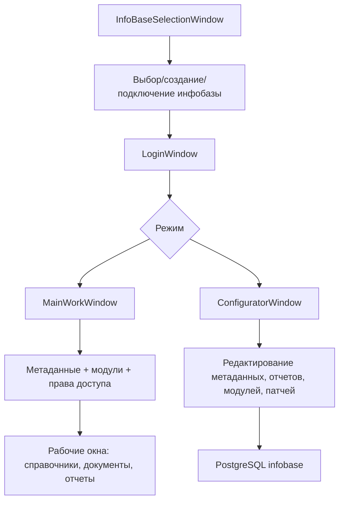
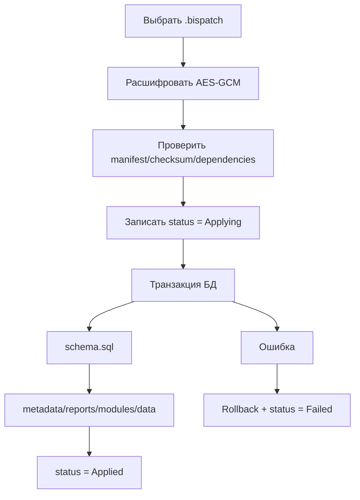

# BIS ERP - актуальная схема проекта

Дата актуализации: 01.07.2026

Документ описывает текущее состояние проекта BIS ERP по коду в рабочей папке. Схема включает последние изменения: механизм патчей инфобаз, версии патчей при создании/подключении базы, зашифрованную выгрузку конфигурации, печатные формы FRX/native, счет-фактуры, ПКО/РКО, журнал проводок, модули и метаданные.

## 1. Общая архитектура

BIS ERP - WPF-приложение на .NET 8 с PostgreSQL. Система построена вокруг метаданных: справочники, документы, отчеты, модули, поля, правила проводок и печатные формы описываются в базе и затем отображаются в рабочем режиме и конфигураторе.

Основные технологии:

- UI: WPF/XAML.
- БД: PostgreSQL через Npgsql и Entity Framework Core.
- PDF/отчеты: QuestPDF, собственный renderer печатных форм.
- Excel: ClosedXML.
- DBF/FRX: DotNetDBF, собственные парсеры Visual FoxPro FRX/FRT.
- MVVM частично: CommunityToolkit.Mvvm используется в `InfoBaseSelectionViewModel`.
- Конфигурация/обновления: зашифрованные `.bisconfig` и `.bispatch`.

Общая схема запуска:

## 2. Физическая структура проекта

| Папка | Назначение |
|---|---|
| `Data` | EF Core `AppDbContext`, подключение к PostgreSQL, DbSet и связи моделей. |
| `Models` | Доменные модели: инфобазы, пользователи, метаданные, отчеты, документы, проводки, патчи, системные настройки. |
| `Services` | Основная бизнес-логика: метаданные, отчеты, документы, патчи, печать, импорт, доступы, темы, локализация. |
| `Views` | Основные WPF-окна и UserControl рабочего режима/конфигуратора. |
| `Views/Dialogs` | Диалоговые окна выбора, редактирования, печати, патчей, деталей. |
| `ViewModels` | ViewModel-слой, сейчас ключевой класс - выбор инфобазы. |
| `Themes` | Ресурсы тем оформления. |
| `Converters` | WPF-конвертеры отображения. |
| `Behaviors` | Поведения UI, включая навигацию Enter. |
| `Assets` | Иконка приложения и статические ресурсы. |
| `Migrations` | EF Core миграции. |
| `Docs` | Техническая документация проекта. |
| `Schemas` | Зарезервировано под схемы/описания. |

## 3. Основные модули системы

### 3.1 Инфобазы и запуск

Отвечает за список информационных баз, подключение к PostgreSQL, создание новой базы, подключение существующей, выбор режима и вход пользователя.

Ключевые файлы:

- `InfoBaseManager.cs` - создание/подключение/удаление/выбор инфобаз, синхронизация версии патча.
- `InfoBaseSelectionWindow.xaml` - стартовое окно выбора инфобазы.
- `CreateInfoBaseDialog.xaml` - создание или подключение базы, включая поле начальной версии патча.
- `InfoBaseSelectionViewModel.cs` - команды выбора, создания, редактирования, удаления, запуска режимов.
- `LoginWindow.xaml` и `RegisterWindow.xaml` - вход и регистрация пользователя.

Последняя логика:

- При создании новой базы задается начальная версия патча, по умолчанию `1.0.0`.
- В инфобазе создается baseline-запись в `system_patches`.
- При подключении существующей базы версия читается из `system_patches`; если истории нет, создается baseline.
- В окне выбора инфобаз отображается версия: `Патч: 1.0.0` или последняя примененная версия.

### 3.2 Метаданные и конфигуратор

Метаданные описывают справочники, документы, поля, таблицы, расчеты, правила проводок.

Ключевые файлы:

- `Metadata.cs` - `MetadataObject`, `MetadataField`, `MetadataCalculation`, `MetadataPostingRule`.
- `MetadataService.cs` - CRUD метаданных, создание динамических таблиц, документы, проводки, нумерация.
- `MetadataService.Catalogs.cs` - предопределенные справочники и синхронизация их структуры.
- `MetadataService.Fields.cs` - наборы полей для системных справочников/документов.
- `MetadataService.DataSeed.cs` - начальные данные.
- `ConfiguratorWindow.xaml` - главное окно конфигуратора.

Ключевая идея:

- `MetadataObject.ObjectType` определяет тип: `Catalog`, `Document`, `Report`.
- `MetadataObject.TableName` указывает физическую таблицу.
- `MetadataField.DbColumnName` указывает физическую колонку.
- UI строится по метаданным, а таблицы создаются динамически.

### 3.3 Модули и навигация

Модули группируют документы и отчеты в рабочем режиме.

Ключевые файлы:

- `MetadataModule.cs` - `MetadataModule`, `MetadataModuleItem`.
- `ModuleMetadataService.cs` - создание и чтение модулей.
- `ModuleManagementView` - управление модулями в конфигураторе.
- `MainWorkWindow.xaml.cs` - построение дерева навигации.

Текущие разделы:

- Справочники.
- Финансы.
- Основные средства.
- Учет материальных ценностей.
- Нераспределенные объекты.
- Служебные данные.
- Администрирование.

### 3.4 Права доступа

Администратор может выдавать доступ пользователям к элементам рабочего окна.

Ключевые файлы:

- `User.cs` - пользователи и роли.
- `UserAccessPermission.cs` - разрешения на элементы навигации.
- `UserAccessService.cs` - таблицы пользователей и прав доступа.
- `UserAccessManagementView.xaml` - дерево доступных возможностей.

### 3.5 Бухгалтерия, проводки и план счетов

Модуль отвечает за план счетов, аналитику по счетам, проводки, отчеты, кассовые операции и счет-фактуры.

Ключевые файлы:

- `PostingService.cs` - журнал проводок, сбор проводок из `doc_postings` и DBF-документов.
- `BalanceService.cs` - оборотные ведомости, баланс, главная книга, финансовые результаты.
- `AccountingPeriodService.cs` - учетные периоды, начальные остатки, снимки оборотов, финансовые строки.
- `AccountAnalyticsHelper.cs` - настройки аналитики счетов и видимость справочников по счету.
- `AccountingReportsView.xaml` - бухгалтерские отчеты.
- `AccountingSetupView.xaml` - настройка бухгалтерского учета.
- `PostingsView.xaml` - ручные проводки.
- `PostingsJournalView.xaml` - журнал проводок.
- `PostingEditDialog.xaml` - ввод/корректировка ручной проводки.

Последняя логика:

- В ручных проводках дебет/кредит выбираются через окно поиска счета.
- Аналитические поля показываются только если разрешены настройкой счета.
- Договор и статья скрыты.
- Сумма в валюте показывается только при валютном признаке счета.
- Двойной щелчок по проводке открывает просмотр.
- Корректировка проводки счет-фактуры открывает саму счет-фактуру.

### 3.6 Кассовые ордера

Приходный и расходный кассовые ордера работают через общую форму.

Ключевые файлы:

- `CashOrderWorkView.xaml` - список ПКО/РКО.
- `CashOrderDialog.xaml` - форма добавления/редактирования.
- `PrintFormService.cs` - печатные формы ПКО/РКО.
- `FrxParser.cs`, `FrxRecognitionProfileService.cs` - импорт FRX/FRT.

Последняя логика:

- ПКО и РКО имеют самостоятельную нумерацию.
- Номер по умолчанию заблокирован, но доступен чекбокс `изменить`.
- При открытии формы фокус ставится на сумму.
- Касса отображается именем, а не GUID.
- Счет кассы берется из справочника `Кассы`, поле `Счет`.
- Печатные формы строятся по FRX/native и открываются во внешнем PDF-просмотрщике.

### 3.7 Платежные поручения

Ключевые файлы:

- `PaymentOrderWorkView.xaml`.
- `PaymentOrderDialog.xaml`.
- `MetadataService` - динамическая структура документа.

Особенности:

- Номер документа числовой, без мнемоники `ПП`.
- Используется общий счетчик документов, кроме ПКО/РКО.
- Корреспондентский счет и аналитика работают по настройкам счета.

### 3.8 Счет-фактуры

Поддерживаются два документа:

- `Выписка счет-фактур`.
- `Регистрация счет-фактур`.

Ключевые файлы:

- `InvoiceModels.cs`.
- `InvoiceMetadataSeedService.cs`.
- `InvoiceService.cs`.
- `InvoiceWorkView.xaml`.
- `InvoiceEditDialog.xaml`.
- `PrintFormService.cs`.

Физические таблицы:

- `doc_sales_invoice`.
- `doc_sales_invoice_lines`.
- `doc_purchase_invoice`.
- `doc_purchase_invoice_lines`.

Последняя логика:

- Двойной щелчок по счет-фактуре открывает режим просмотра без возможности изменения.
- Кнопка `Редактировать` открывает обычное редактирование.
- Из окна проводок корректировка счет-фактуры открывает сам документ.
- Проводить счет-фактуру из списка убрано.
- В форме счет-фактуры коды справочников не показываются пользователю.
- Выбор счета выполняется через окно поиска.
- Повторная строка копирует настройки предыдущей строки.
- Курсор после добавления строки ставится в сумму без налога.
- Печать счет-фактур идет через FRX/native механизм.

### 3.9 Отчеты и печатные формы

Система отчетов включает табличные отчеты, печатные формы, FRX/FRT импорт и нативный графический макет.

Ключевые файлы:

- `Report.cs` - модель отчета.
- `ReportService.cs` - отчеты конфигуратора.
- `PrintFormService.cs` - печатные формы и PDF.
- `ReportDesignerWindow.xaml` - конструктор отчетов.
- `ReportPreviewWindow.xaml` - предпросмотр отчетов.
- `PdfPreviewWindow.xaml` - окно PDF.
- `FrxParser.cs` - чтение FRX/FRT.
- `FrxToReportConverter.cs` - преобразование FRX в отчет.
- `FrxRecognitionProfileService.cs` - профили распознавания FRX.
- `FoxExpressionParser.cs` - вычисление выражений FoxPro.

Последняя логика:

- PDF больше не открывается через WPF `WebBrowser`.
- PDF пишется во временную папку `%LocalAppData%\BIS.ERP\Preview`.
- Открытие выполняется системным PDF-просмотрщиком.
- Сохранение PDF пишет байты напрямую.
- FRX-распознавание содержит встроенные профили без внешнего JSON-файла.

### 3.10 DBF/FRX импорт

Ключевые файлы:

- `DbfParserService.cs`.
- `DbfImportWindow.xaml`.
- `FrxImportWindow.xaml`.
- `FrxParser.cs`.
- `FrxToReportConverter.cs`.

Назначение:

- Импорт DBF-документов.
- Импорт печатных форм Visual FoxPro `.frx/.frt`.
- Преобразование макета в `Report` + `ReportElementMapping`.
- Поддержка выражений FoxPro и legacy-полей.

### 3.11 Системные настройки, темы, локализация

Ключевые файлы:

- `SystemConfiguration.cs`.
- `SystemConfigurationService.cs`.
- `SettingsWindow.xaml`.
- `AboutSystemDialog.xaml`.
- `ThemeService.cs`.
- `LocalizationService.cs`.
- `LocalizationEntry`.

Назначение:

- Наименование системы.
- Иконка/символ системы.
- Описание.
- Реквизиты компании.
- Почта и телефон.
- Темы оформления.
- Подготовка мультиязычного интерфейса через таблицу переводов.

### 3.12 Патчи и сопровождение клиентских баз

Это последний добавленный важный механизм.

Ключевые файлы:

- `BisPatchModels.cs`.
- `BisPatchService.cs`.
- `BisPackageCryptoService.cs`.
- `PatchManagerDialog.xaml`.
- `ConfigurationExchangeService.cs`.
- `BIS_PATCH_FORMAT.md`.

Форматы:

- `.bispatch` - зашифрованный пакет патча.
- `.bisconfig` - зашифрованная выгрузка конфигурации.
- `.bisconfig.json`/`.json` - legacy-форматы, оставлены для совместимости.

Состав `.bispatch`:

- `manifest.json` - паспорт патча.
- `schema.sql` - SQL-изменения структуры.
- `metadata.json` - метаданные.
- `reports.json` - отчеты и печатные формы.
- `modules.json` - модули и привязки объектов.
- `data.json` - данные таблиц в режиме `Upsert` или `Replace`.

Таблица истории:

- `system_patches`.

Порядок применения:

## 4. Основные сервисы

| Сервис | Ответственность |
|---|---|
| `AccountAnalyticsHelper` | Настройки связей счетов с аналитическими справочниками, видимость аналитик. |
| `AccountingPeriodService` | Учетные периоды, начальные остатки, снимки оборотов, финансовые строки. |
| `ApplicationExitService` | Единый сценарий выхода из приложения с подтверждением. |
| `AppNavigationService`, `NavigationService` | Переключение UserControl в рабочей области. |
| `AppSettings` | Локальные настройки приложения: PostgreSQL, тема, язык, тестовые проводки. |
| `AuthService`, `IAuthService` | Авторизация, регистрация, BCrypt/legacy-хеши. |
| `BalanceService` | ОСВ, оборотный баланс, главная книга, баланс, финрезультаты. |
| `BisPackageCryptoService` | Шифрование/расшифровка `.bispatch` и `.bisconfig`. |
| `BisPatchService` | Создание таблицы патчей, применение патчей, история, baseline-версия. |
| `ConfigurationExchangeService` | Выгрузка/загрузка конфигурации, теперь с encrypted `.bisconfig`. |
| `DbfParserService` | Чтение DBF. |
| `DocumentationMetadataSeedService` | Метаданные по документации: модули, документы, структуры. |
| `DocumentService` | Работа с импортированными/динамическими документами. |
| `DynamicObjectService` | Генерация проводок/операций по динамическим объектам. |
| `EmployeeService` | Работа со справочником сотрудников. |
| `EventLogService` | Журнал событий в таблицу `events` и файлы `logs/events_yyyyMMdd.log`. |
| `FoxExpressionParser` | Разбор выражений Visual FoxPro для печатных форм. |
| `FrxParser` | Парсинг FRX/FRT. |
| `FrxRecognitionProfileService` | Встроенные профили распознавания FRX. |
| `FrxToReportConverter` | Конвертация FRX-макета в модель отчета. |
| `InfoBaseManager` | Инфобазы, подключение, создание, версия патча, текущая база. |
| `InitialDataProvider` | Начальные данные. |
| `InvoiceMetadataSeedService` | Метаданные счет-фактур. |
| `InvoiceService` | Таблицы, CRUD, строки, проводки и поиск счет-фактур. |
| `LocalizationService` | Таблица переводов и текущая культура. |
| `MetadataService` | Центральный сервис метаданных, динамические таблицы, документы, нумерация, проводки. |
| `ModuleMetadataService` | Модули и разделы навигации. |
| `PostingService` | Журнал проводок и детализация. |
| `PrintFormService` | Печатные формы, PDF, seed стандартных форм. |
| `ReferenceDisplayHelper` | Читаемые значения ссылочных полей вместо GUID. |
| `ReportService` | Отчеты, заголовки, навигация, экспорт. |
| `RuntimeSchemaFixService` | Безопасные ALTER TABLE для старых баз. |
| `ServiceLocator` | Доступ к singleton-сервисам. |
| `SiteService` | Участки. |
| `SystemConfigurationService` | Настройки системы и реквизиты. |
| `ThemeService` | Переключение тем. |
| `TrayManager` | Системный трей. |
| `UserAccessService` | Пользователи и права на навигацию. |
| `WindowDialogService`, `IDialogService` | Абстракция диалогов для ViewModel. |

## 5. Основные View

| View | Назначение |
|---|---|
| `InfoBaseSelectionWindow` | Стартовый выбор инфобазы, отображение версии патча. |
| `ModeSelectionWindow` | Выбор режима, если используется старый сценарий. |
| `LoginWindow` | Вход пользователя, Enter-навигация. |
| `RegisterWindow` | Регистрация пользователя. |
| `MainWorkWindow` | Главное рабочее окно, дерево модулей, навигация. |
| `ConfiguratorWindow` | Конфигуратор: метаданные, отчеты, модули, патчи, выгрузка/загрузка. |
| `CatalogDataView` | Универсальный список данных справочника. |
| `EmployeesCatalogView` | Справочник сотрудников. |
| `DynamicDocumentWorkView` | Универсальное окно динамического документа. |
| `CashOrderWorkView` | ПКО/РКО. |
| `PaymentOrderWorkView` | Платежные поручения. |
| `InvoiceWorkView` | Выписка/регистрация счет-фактур. |
| `PostingsView` | Ручные проводки. |
| `PostingsJournalView` | Общий журнал бухгалтерских проводок. |
| `AccountingReportsView` | Бухгалтерские отчеты и анализ счета. |
| `AccountingSetupView` | Настройка бухгалтерского учета. |
| `DbfImportWindow` | Импорт DBF. |
| `DynamicDocumentsView` | Список импортированных DBF/динамических документов. |
| `FrxImportWindow` | Импорт FRX/FRT. |
| `ReportDesignerWindow` | Конструктор отчетов и нативных макетов. |
| `ReportPreviewWindow` | Предпросмотр отчета. |
| `PdfPreviewWindow` | PDF-предпросмотр через внешний просмотрщик. |
| `UserAccessManagementView` | Настройка доступов пользователей. |
| `SettingsWindow` | Настройки системы, тема, язык, реквизиты. |
| `SetupWindow` | Настройка подключения/первого запуска. |
| `InfoBasesView` | Служебное управление инфобазами. |

## 6. Диалоговые окна

| Dialog | Назначение |
|---|---|
| `AboutSystemDialog` | О системе, реквизиты, контакты. |
| `AccountSelectionDialog` | Поиск и выбор счета. |
| `CashOrderDialog` | Добавление/редактирование ПКО/РКО. |
| `CreateDynamicObjectDialog` | Создание динамического объекта. |
| `DocumentPostingsDialog` | Проводки документа. |
| `DynamicDocumentItemDialog` | Строка/документ динамического объекта. |
| `EditInfoBaseDialog` | Переименование инфобазы. |
| `EmployeeDialog` | Сотрудник. |
| `InvoiceEditDialog` | Счет-фактура: создание, редактирование, просмотр readonly. |
| `PatchManagerDialog` | История и применение `.bispatch`. |
| `PaymentOrderDialog` | Платежное поручение. |
| `PostingDetailsDialog` | Просмотр деталей проводки. |
| `PostingSearchDialog` | Поиск проводки. |
| `PrintFormSelectionDialog` | Выбор печатной формы. |
| `ReferenceSelectionDialog` | Универсальный выбор элемента справочника. |
| `TerminationDialog` | Увольнение/завершение. |
| `TurnoversDialog` | Обороты по счету. |

## 7. Структура БД

### 7.1 Master-база

Master-база хранит список инфобаз и служебные таблицы приложения.

Ключевая таблица:

| Таблица | Назначение |
|---|---|
| `InfoBases` | Список информационных баз: имя, host, port, database, пользователь, пароль, активная база, версия патча. |

Поле `InfoBases.Version`:

- хранит последнюю известную версию патча инфобазы;
- синхронизируется при загрузке списка инфобаз;
- обновляется после применения патча.

### 7.2 Основные таблицы инфобазы

| Таблица | Назначение |
|---|---|
| `MetadataObjects` | Справочники, документы, отчеты как конфигурируемые объекты. |
| `MetadataFields` | Поля объектов метаданных. |
| `MetadataCalculations` | Расчеты по объектам. |
| `MetadataPostingRules` | Правила проводок документов. |
| `MetadataConfigurations` | Состояние и версия конфигурации метаданных. |
| `MetadataModules` | Разделы/модули рабочего интерфейса. |
| `MetadataModuleItems` | Привязка документов/отчетов к модулям. |
| `Reports` | Отчеты и печатные формы. |
| `ReportFields` | Поля табличных отчетов. |
| `ReportFilters` | Фильтры отчетов. |
| `ReportGroups` | Группировки отчетов. |
| `ReportElementMappings` | Элементы FRX/native макетов и привязка к данным. |
| `SystemConfigurations` | Наименование системы, иконка, описание, реквизиты, контакты. |
| `LocalizationEntries` | Переводы интерфейса и системных значений. |
| `Users` | Пользователи. |
| `UserAccessPermissions` | Доступы пользователей к навигации. |
| `system_patches` | История примененных патчей инфобазы. |
| `events` | Журнал событий пользователей/системы. |
| `doc_numbering` | Счетчики номеров документов. |
| `doc_postings` | Единая таблица бухгалтерских проводок. |

### 7.3 Динамические таблицы

Создаются по `MetadataObject.TableName`.

Примеры:

| Таблица | Назначение |
|---|---|
| `catalog_*` | Справочники: план счетов, кассы, банки, валюты, налоги, виды поставки и т.д. |
| `doc_*` | Документы: ПКО, РКО, платежные поручения, приход/расход товаров и др. |
| `doc_sales_invoice` | Выписка счет-фактур, заголовок. |
| `doc_sales_invoice_lines` | Строки выписки счет-фактур. |
| `doc_purchase_invoice` | Регистрация счет-фактур, заголовок. |
| `doc_purchase_invoice_lines` | Строки регистрации счет-фактур. |

### 7.4 Бухгалтерские таблицы

| Таблица | Назначение |
|---|---|
| `AccountingPeriods` | Учетные периоды. |
| `AccountOpeningBalances` | Начальные остатки по счетам. |
| `AccountTurnoverSnapshots` | Снимки оборотов. |
| `FinancialReportLines` | Строки финансовых отчетов. |
| `FinancialReportLineAccounts` | Связь строк отчетов со счетами. |
| `TaxJournalRecords` | Налоговые журналы. |

### 7.5 Импорт DBF

| Таблица | Назначение |
|---|---|
| `DynamicDocuments` | Заголовки импортированных DBF/динамических документов. |
| `DynamicDocumentRows` | Строки импортированных документов в `jsonb`. |
| `DbfMetadata` | Метаданные DBF-файла. |

## 8. Метаданные

### 8.1 `MetadataObject`

Главная сущность конфигуратора.

Ключевые поля:

- `Id` - идентификатор объекта.
- `Name` - имя объекта.
- `TableName` - физическая таблица.
- `ObjectType` - `Catalog`, `Document`, `Report`.
- `Description` - описание.
- `Icon` - иконка.
- `Order` - порядок.
- `UsePostings` - документ формирует проводки.
- `UseBalances` - объект использует остатки.
- `UseMovements` - объект использует движения.
- `BalanceTable`, `MovementTable` - таблицы остатков/движений.
- `ReferenceFields` - JSON связей.

### 8.2 `MetadataField`

Описывает поле объекта.

Ключевые поля:

- `Name` - имя поля в интерфейсе.
- `DbColumnName` - имя колонки в БД.
- `FieldType` - `String`, `Decimal`, `DateTime`, `Bool`, `Reference` и др.
- `Length`, `Precision`, `Scale`.
- `IsRequired`, `IsUnique`.
- `ReferenceCatalog` - справочник для ссылочного поля.
- `Formula` - формула.
- `DisplayPattern`, `DisplayFields` - отображение ссылки вместо GUID.

### 8.3 Правила проводок

`MetadataPostingRule` хранит:

- выражение дебета;
- выражение кредита;
- выражение суммы;
- условие;
- порядок выполнения.

### 8.4 Нумерация документов

Таблица: `doc_numbering`.

Текущие правила:

- общий счетчик для большинства документов;
- ПКО и РКО имеют самостоятельные счетчики;
- все номера документов числовые;
- старые мнемоники удаляются/нормализуются;
- если номер не удалось получить, используется fallback.

## 9. Отчеты и печатные формы

### 9.1 `Report`

Содержит:

- имя, описание, код;
- тип источника данных;
- тип отчета;
- шаблон;
- настройки страницы;
- активность;
- признак печатной формы;
- формат источника: `Native`, `FoxProFRX` и др.;
- версию шаблона.

### 9.2 `ReportElementMapping`

Используется для FRX/native макетов.

Хранит:

- тип элемента: текст, поле, линия, рамка;
- текст/выражение;
- band: header/body/footer/detail;
- координаты и размеры;
- шрифт, жирность, курсив, выравнивание;
- привязку к полю данных;
- пользовательский текст.

### 9.3 Конструктор отчетов

`ReportDesignerWindow` содержит вкладки:

- общие параметры;
- поля;
- FRX поля;
- нативный макет;
- оформление;
- фильтры.

## 10. Патчи инфобаз

Таблица: `system_patches`.

Поля:

- `patch_id` - уникальный код патча.
- `version` - версия после применения.
- `name` - наименование.
- `description` - описание.
- `checksum` - контрольная сумма пакета.
- `applied_at` - дата применения.
- `applied_by` - пользователь ОС.
- `app_version` - версия приложения.
- `status` - `Pending`, `Applying`, `Applied`, `Failed`.
- `error` - текст ошибки.
- `created_at` - дата создания записи.

Baseline:

- при создании инфобазы создается `baseline-1.0.0`;
- при подключении старой базы baseline создается, если `system_patches` пустая;
- версия отображается в окне выбора инфобазы.

## 11. Событийный журнал

Таблица: `events`.

Файл: `logs/events_yyyyMMdd.log`.

Пишутся события:

- создание/изменение/удаление динамических записей;
- проведение/отмена проведения;
- операции со счет-фактурами;
- применение патчей;
- технические действия сопровождения.

## 12. Последние существенные изменения

- Добавлен механизм `.bispatch`.
- Добавлена таблица `system_patches`.
- Добавлена baseline-версия патча при создании/подключении инфобазы.
- Добавлено отображение версии патча в окне выбора инфобаз.
- Выгрузка конфигурации стала зашифрованной `.bisconfig`.
- Сохранена загрузка старых JSON-конфигураций.
- Добавлен менеджер патчей в конфигураторе.
- PDF-предпросмотр переведен с `WebBrowser` на внешний системный PDF-просмотрщик.
- ПКО/РКО получили самостоятельную нумерацию.
- Касса в ПКО/РКО и проводках отображается названием/счетом, а не GUID.
- Счет-фактуры открываются по двойному щелчку в режиме просмотра.
- Корректировка проводки счет-фактуры открывает сам документ счет-фактуры.
- Убрано понятие контрагента из навигации/логики, где оно было лишним.
- Подготовлены модули: финансы, основные средства, учет материальных ценностей.
- Добавлены/улучшены бухгалтерские отчеты и отчетный контур.

## 13. Рекомендуемые следующие шаги

1. Сделать инструмент сборки `.bispatch` из папки прямо в конфигураторе.
2. Добавить цифровую подпись патча поверх текущего AES-GCM контейнера.
3. Вынести профили распознавания FRX в таблицу БД с UI редактирования.
4. Добавить экран сравнения версии приложения и версии инфобазы.
5. Добавить обязательный backup перед применением патча.
6. Описать стандарт разработки патчей: имя, номер, зависимости, rollback-подход.
