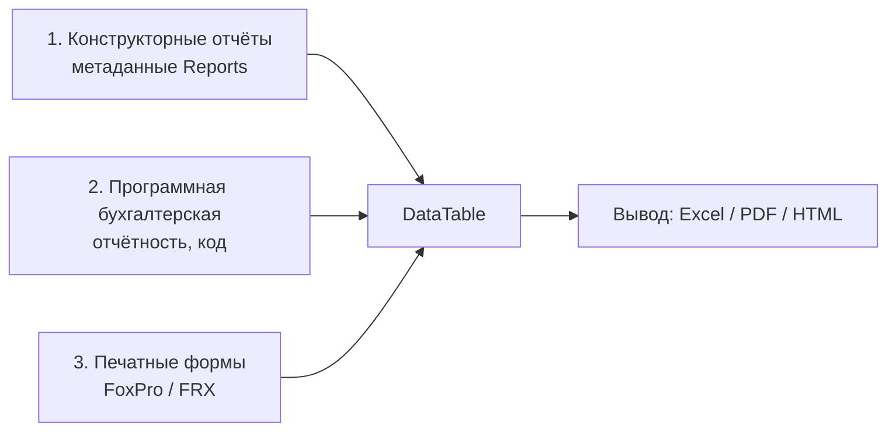
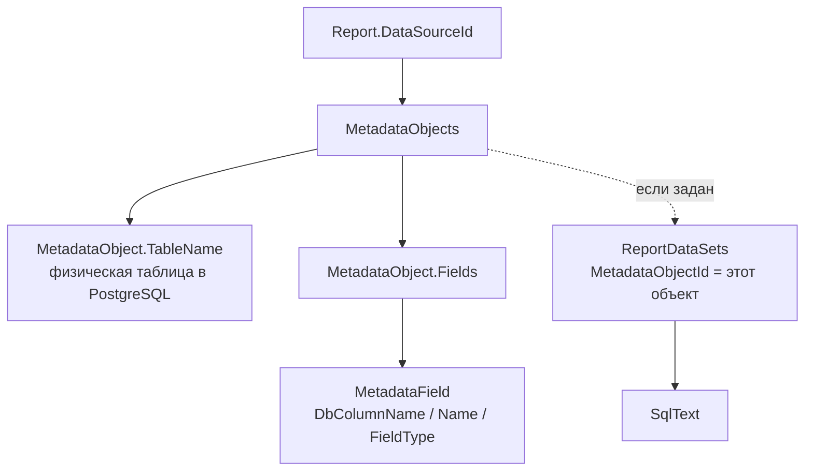
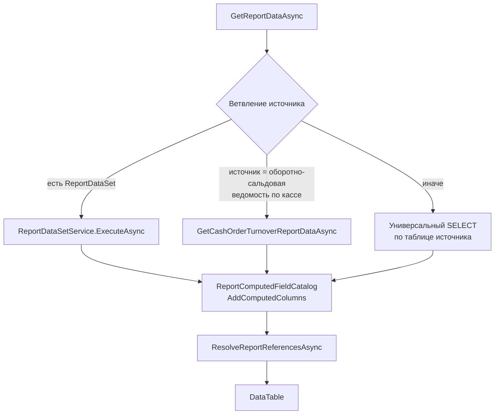
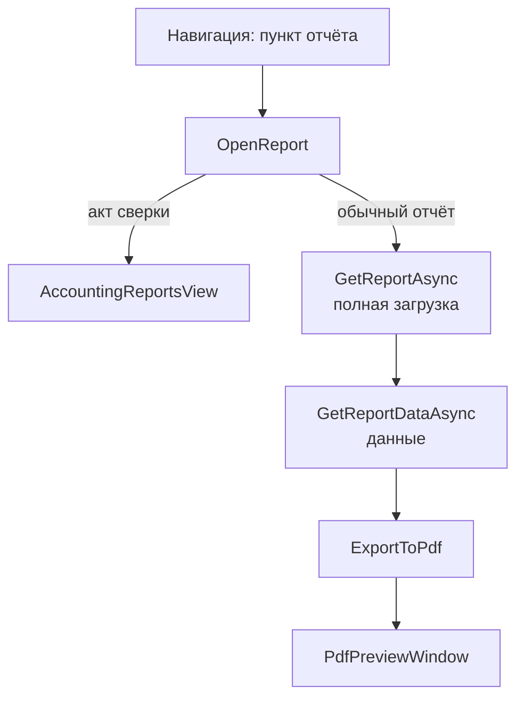
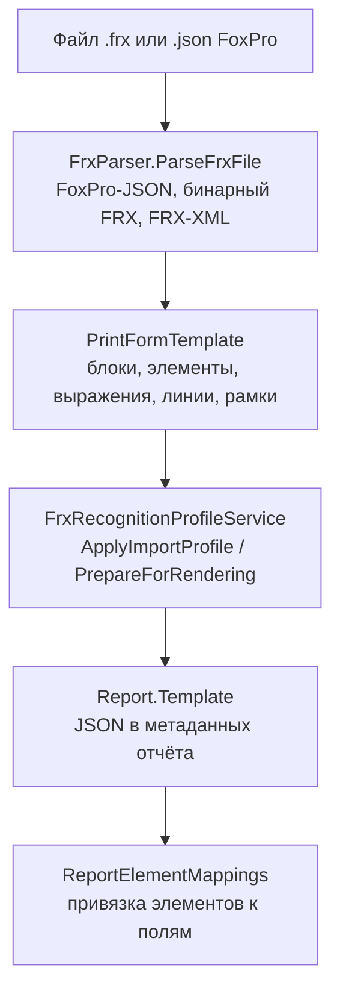

# Отчётность в BIS ERP

> [!info] Этот файл
> Obsidian-вариант документа [[ReportingArchitecture]]. Таблицы заменены на callout-блоки и списки, ASCII-схемы — на mermaid, ссылки на документы — на wikilinks.
> Каноничная версия для репозитория: `Docs/ReportingArchitecture.md`. При расхождениях правильная она.

---

## 0. Коротко

> [!abstract] Главная мысль
> Отчёт в системе — это **не файл, а запись в метаданных** `Reports` + **источник данных** + **макет**.
> Данные отчёта материализуются в `DataTable`, дальше этот же `DataTable` уходит в три разных движка вывода: программный, нативный (конструктор) и FoxPro/FRX.

Три важных следствия:

1. Логика отчёта (что выбрать, что отфильтровать) лежит в метаданных, а код отвечает только за транспорт и вёрстку.
2. В системе **три независимых механизма отчётности**, и они не пересекаются — важно не искать отчёт не там.
3. Стандартные отчёты не создаются вручную: они **досеиваются при старте приложения** и «защищены от воскрешения» отдельным сервисом.

---

## Оглавление

- [[#1. Три механизма отчётности]]
- [[#2. Карта кода]]
- [[#3. Модель данных]]
- [[#4. Как отчёт привязан к данным]]
- [[#5. Конвейер формирования данных]]
- [[#6. Наборы данных (ReportDataSetService)]]
- [[#7. Вычисляемые поля и нормализация имён]]
- [[#8. Ссылки, фильтры, группировки, итоги]]
- [[#9. Пользовательский интерфейс]]
- [[#10. Формирование и вывод]]
- [[#11. Импорт FoxPro/FRX и печатные формы]]
- [[#12. Стандартные отчёты]]
- [[#13. Ограничения и точки роста]]
- [[#14. Типовые рецепты]]
- [[#15. Тесты]]
- [[#16. Глоссарий]]

---

## 1. Три механизма отчётности



### 1.1 Конструкторные отчёты (метаданные) — основной механизм

Отчёт — строка в таблице `Reports`. Пользователь (или программист через конструктор) выбирает источник данных (объект метаданных), набор колонок, фильтры, оформление. Система сама строит `SELECT` и выводит результат.

> [!note] Характеристики
> - **Где хранится:** `Reports`, `ReportFields`, `ReportFilters`, `ReportElementMappings`
> - **Источник данных:** `Report.DataSourceId` → `MetadataObjects` (справочник или документ)
> - **Кто формирует данные:** `ReportService.GetReportDataAsync`
> - **Кто формирует вид:** `ReportService.ExportToPdf` / `ExportToExcel`, `PrintFormService`
> - **Настройка:** `Views/ReportDesignerWindow.xaml(.cs)` — конструктор

### 1.2 Программная бухгалтерская отчётность — «жёсткая» аналитика

Отдельный экран `AccountingReportsView` («Бухгалтерская отчетность»). Здесь 9 отчётов **написаны кодом** и собираются из проводок и периодов:

- Оборотно-сальдовая ведомость
- Главная книга
- Баланс предприятия
- Финансовые результаты
- Журнал закупок и продаж
- Сальдо по организациям
- Сбор информации за период
- Реестр платёжных поручений
- Акт сверки

> [!note] Характеристики
> - **Где хранится:** код `Views/AccountingReportsView.xaml.cs` (методы `Build*Async`)
> - **Источник данных:** проводки, платёжные поручения, счета-фактуры, периоды
> - **Результат:** пара `(DataTable, Report)` — отчёт-объект создаётся на лету (`CreateReport`)
> - **Нюанс:** эти отчёты **не лежат** в `Reports`, поэтому их нельзя редактировать конструктором

Каждый такой отчёт дополнительно умеет закрывать/открывать период («Закрыть баланс») и связывается с FRX-вариантами (`LoadTrialBalanceReportVariantsAsync`, `LoadReconciliationReportVariantsAsync`).

### 1.3 Печатные формы и FoxPro/FRX — перенос legacy-форм

Импорт старых форм Visual FoxPro (`.frx`) и их рендеринг. Это отдельный движок: свой парсер, свой язык выражений, своя база знаний и правила распознавания полей.

> [!note] Характеристики
> - **Ядро:** `PrintFormService` (~2900 строк) + `FrxParser`
> - **Распознавание:** `FrxRecognitionProfileService`, `FoxProReportKnowledgeBase`, `FoxProReportFieldRuleService`
> - **Выражения:** `FoxExpressionParser` (свой интерпретатор Fox-выражений)
> - **Настройка:** вкладки `FRX поля` и `🧱 Нативный макет` в конструкторе

Подробная инструкция по переносу форм: [[FoxProReportRules]].

### 1.4 Сравнение механизмов

**Хранится в БД:**
- Конструкторные — да, в `Reports`
- Программные — нет, в коде
- FRX / печатные формы — да, в `Reports` с `SourceFormat=FoxProFRX`

**Источник данных:**
- Конструкторные — метаданные + SQL-наборы
- Программные — проводки напрямую
- FRX / печатные формы — то же, что у отчёта-владельца

**Редактируется пользователем:**
- Конструкторные — да, конструктор
- Программные — нет
- FRX / печатные формы — да, вкладки FRX и нативного макета

**Типовой вывод:**
- Конструкторные — PDF, сразу при открытии
- Программные — Excel / PDF / FRX / налоговый
- FRX / печатные формы — PDF или Excel по макету

### 1.5 Смежные сервисы

- `ReportDataSetService` — пользовательские SQL-наборы данных поверх объектов метаданных
- `ReportComputedFieldCatalog` — канонические вычисляемые поля и алиасы FoxPro-имён
- `RegulatedReportTemplateService` — регламентированные шаблоны (xlsx) с версиями и SHA-256
- `StandardReportDeletionService` — «кладбище» кодов удалённых стандартных отчётов
- `VatTaxReportExportService` — налоговый Excel по журналу покупок/продаж
- `AdvancePaymentsTurnoverReportService` — оборотно-сальдовая ведомость по авансам (Excel, ClosedXML)
- `StandardFrxReportTemplates.generated.cs` — сгенерированные FRX-макеты стандартных отчётов

---

## 2. Карта кода

> [!tip] Как читать
> Все пути относительно корня проекта `BIS.ERP`.

**Модели**
- `Models/Report.cs` — `Report`, `ReportField`, `ReportFilter`, `ReportGroup`, `ReportHeaderFooter`
- `Models/ReportDataSet.cs` — `ReportDataSet`, `ReportDataSetField`
- `Models/FrxReport.cs` — `FrxReport`, `FrxBand`, `FrxField`, `FrxExpression`
- `Models/RegulatedReportTemplate.cs` — регламентированные шаблоны
- `Models/FoxProReportFieldRule.cs` — правила распознавания FoxPro-полей

**Данные**
- `Data/AppDbContext.cs` — `DbSet<Report*>` и индексы

**Ядро**
- `Services/ReportService.cs` — формирование данных + программный Excel/PDF/HTML
- `Services/ReportDataSetService.cs` — SQL-наборы, валидация, синхронизация полей
- `Services/PrintFormService.cs` — печатные формы, FRX/native PDF и Excel
- `Services/FrxParser.cs` — чтение FRX (JSON / бинарный / XML)

**FoxPro**
- `Services/FoxProReportKnowledgeBase.cs` — нормализация имён, алиасы, префиксы наборов
- `Services/FoxExpressionParser.cs` — вычисление Fox-выражений
- `Services/FoxProReportFieldRuleService.cs` — правила в БД (`FoxProReportFieldRules`)
- `Services/FrxRecognitionProfileService.cs` — профили распознавания и выравнивания

**Метаданные**
- `Services/MetadataService.Reports.cs` — досев стандартных отчётов и FRX-вариантов
- `Services/ModuleMetadataService.cs` — привязка отчётов к модулям и порядок в навигации

**UI**
- `Views/ReportDesignerWindow.xaml` — конструктор (6 вкладок)
- `Views/ReportPreviewWindow.xaml` — предпросмотр и экспорт
- `Views/AccountingReportsView.xaml` — бухгалтерская отчётность
- `Views/ReportDataSetManagementView.xaml(.cs)` — управление SQL-наборами
- `Views/MainWorkWindow.xaml.cs` — навигация и открытие отчёта

---

## 3. Модель данных

### 3.1 Ядро конструктора (`Reports`)

`Report` — одна таблица, которая описывает и содержание, и вид:

- **Идентификация:** `Id`, `Name`, `Description`, `Code`, `Icon`, `Order`
- **Источник:** `DataSourceType`, `DataSourceId`, `MetadataObjectId` (у наборов данных)
- **Вид:** `ReportType`, `SourceFormat` (`Native` / `FoxProFRX`), `Template`, `TemplateVersion`, `Settings`
- **Признаки:** `IsActive`, `IsPrintForm`, `IsDefault`, `IsSystem`
- **Страница:** `PageOrientation`, `PageWidth` / `PageHeight`, поля отступов, `FontName`, `FontSize`
- **Оформление:** `ShowHeader`, `ShowFooter`, `ShowPageNumbers`, `ShowGridLines`, `ShowGrandTotal`, `HeaderColor`, `AlternateRowColor`
- **Тексты:** `TitleText`, `SubtitleText`, `HeaderText`, `FooterText`, `FooterTotalText`, `FooterSignature`, `SummaryText`

**Дочерние сущности** (все с `ON DELETE CASCADE`):

- **`ReportField`** — колонка отчёта. Ключевые поля: `FieldName` (DbColumnName источника), `DisplayName` (заголовок), `Width`, `Alignment`, `Format`, `AggregateType`, `IsVisible`, `Order`.
- **`ReportFilter`** — условие отбора. Ключевые поля: `FieldName`, `Operation`, `Value`, `Value2`, `Order`.
- **`ReportGroup`** — группировка. Ключевые поля: `FieldName`, `Header`, `Footer`, `PageBreak`, `ShowHeader`, `ShowFooter`.
- **`ReportElementMapping`** — привязка элементов макета к данным. Ключевые поля: `ElementText`, `ElementExpression`, `BandType`, координаты, `MappedFieldName`, `MappedDisplayName`, `FormatString`, `CustomText`.
- **`ReportHeaderFooter`** — тексты шапки и подвала. Ключевые поля: `SectionType`, `Content`, шрифты.

> [!tip] Важный индекс
> `ReportElementMappings (ReportId, ElementOrder)` — влияет на производительность предпросмотра FRX.

### 3.2 Наборы данных (`ReportDataSets`, `ReportDataSetFields`)

- `Code` — уникальный код (например `cash.order.turnover`), есть уникальный индекс
- `MetadataObjectId` — привязка к объекту метаданных, по ней набор подхватывается отчётом
- `SqlText` — SQL-текст, фактический источник данных
- `IsSystem` — системный набор защищён от случайной перезаписи
- `Fields` — снимок колонок результата: `Name`, `DbColumnName`, `FieldType`, `Order`

### 3.3 FoxPro-правила (`FoxProReportFieldRules`)

`SourcePattern` (индексируется), `CanonicalField`, `MappedFieldName`, `ProfileCode`, `Priority`, `IsRegex`, `IsActive`, `Description`.
Индексы: по `SourcePattern` и по `(ProfileCode, IsActive)`.

### 3.4 Регулируемые шаблоны

`RegulatedReportTemplates`: `Code` + `Version` (уникальная пара), `TemplateData` (байты файла), `Sha256`, `MimeType`, `EffectiveFrom`, `IsActive`.
Активной считается последняя версия по коду; `SetActiveTemplateAsync` гасит остальные версии, `InferDraftFromFileName` разбирает имя файла в код, название и версию.

### 3.5 Служебная таблица

`DeletedStandardReports`: `Code` (первичный ключ), `Name`, `DeletedAt`, `DeletedBy`, `Reason`.
Это «кладбище»: при досеве стандартных отчётов коды отсюда пропускаются, иначе удалённый пользователем отчёт возвращался бы после каждого запуска.
`IsStandardReportCode` считает стандартными коды с префиксами: `standard.`, `assets.`, `inventory.`, `cash.receipt.`, `cash.payment.`, `invoice.sales.`, `invoice.purchase.`, `payment.order.`.

### 3.6 Финансовые формульные строки

`FinancialReportLines` (уникальный `ReportCode` + `LineCode`) и `FinancialReportLineAccounts` (уникальный `LineId` + `AccountCode`) — настройка формул баланса и финансовых результатов.

---

## 4. Как отчёт привязан к данным



> [!warning] Ключевой момент
> `ReportField.FieldName` — это **не** заголовок колонки, а физическое имя колонки источника (`DbColumnName`).
> `ReportField.DisplayName` — то, что видит пользователь.
> Именно поэтому в SQL используется конструкция `CAST("db_column" AS text) AS "Отображаемое имя"`.

**Типы полей источника** (`MetadataField.FieldType`) влияют на поведение:

- `Reference` — в SQL приводится к `text`, затем GUID заменяется на отображаемое имя через `ReferenceDisplayHelper`
- `Decimal` — формат по умолчанию `N2`
- `DateTime` — формат по умолчанию `dd.MM.yyyy`
- остальные — формат по умолчанию пустой

Если в отчёте поле не описано, а в источнике поля нет, срабатывают два «моста» совместимости:
`TryBuildComputedReportFieldSelect` (вычисляемое поле из `ReportComputedFieldCatalog`) и
`TryBuildCompatibleReportFieldSelect` (спец-совместимость для источников «Проводки» и «Касса»).
Если не сработал ни один — бросается понятная ошибка: «Поле '...' отсутствует в источнике '...'».

---

## 5. Конвейер формирования данных

Всё живёт в `ReportService.GetReportDataAsync`.



Последовательность:

1. **Проверки.** Отчёт не пустой; заполнен `DataSourceId`; источник метаданных существует.
2. **Определение колонок.** Берутся видимые `ReportFields` по `Order`. Если полей нет вообще — берутся все поля источника, кроме `Id`.
3. **Ветвление источника** — три ветки, порядок важен:
   - у источника есть свой `ReportDataSet` → выполняется SQL набора, результат — основа отчёта;
   - источник — оборотно-сальдовая ведомость по кассе → специализированный `GetCashOrderTurnoverReportDataAsync` с расчётом входящих и исходящих остатков;
   - иначе → универсальный `SELECT` по таблице источника.
4. **Сборка SELECT.** Для каждой колонки: `QuoteIdentifier(DbColumnName) AS QuoteIdentifier(DisplayName)`. Если ни одной — исключение «В отчете не выбрано ни одного видимого поля».
5. **Фильтры.** `BuildFilterClauses` строит `WHERE` **с параметрами** (`@filter0`, `@filter1`, …), а не конкатенацией строк. Поддерживаются `=`, `<`, `>`, `<=`, `>=`, `<>`, `Like` (`ILIKE`), `Between`. Значения приводятся к типу поля (`ConvertFilterValue`).
6. **Служебные фильтры.** `AddDefaultFixedAssetSnapshotFilterAsync` подставляет период по ОС, если в условиях его ещё нет.
7. **Выполнение.** Таймаут 30 с (60 с для тяжёлых отчётов), `DataTable.Load(reader)`.
8. **Вычисляемые поля.** `ReportComputedFieldCatalog.AddComputedColumns` добавляет канонические колонки, которых не хватает.
9. **Ссылки.** `ResolveReportReferencesAsync` заменяет GUID на отображаемые значения.

> [!tip] Ошибки
> Ошибки PostgreSQL ловятся отдельно (`PostgresException`) — сообщение переводится на русский и показывается пользователю.

---

## 6. Наборы данных (`ReportDataSetService`)

Это способ задать произвольную выборку (JOIN, CTE, оконные функции) и подключить её к обычному объекту метаданных. После этого любой отчёт на этот объект будет работать с новым SQL.

### 6.1 Жизненный цикл

1. `EnsureSchemaAsync` — создаёт `ReportDataSets` и `ReportDataSetFields` через `CREATE TABLE IF NOT EXISTS`.
2. `SaveAsync` — сохраняет набор; `NormalizeSql` чистит текст.
3. `TestAsync(dataSet, limit = 50)` — прогон под лимитом для проверки.
4. `RefreshFieldsFromSqlAsync` — выполняет `LIMIT 0`, читает колонки результата и **пересоздаёт** список полей.
5. `SyncMetadataSourceAsync` — синхронизирует объект метаданных с набором (создаёт или чинит поля объекта).
6. `ExecuteAsync` — рабочий прогон с параметрами.

### 6.2 Как выполняется SQL

```sql
SELECT * FROM (<текст набора>) AS report_dataset_result   [LIMIT @__bis_limit]
```

- Обёртка в подзапрос нужна, чтобы `LIMIT` и параметры добавлялись без правки пользовательского SQL.
- Подключение — отдельное `NpgsqlConnection` (`OpenStandaloneConnectionAsync`), а не контекст EF.
- Таймаут 60 секунд.
- `AddSqlParameters` подставляет значения только для плейсхолдеров, реально встречающихся в тексте.
- Разрешены только `SELECT` и `WITH` — это указано прямо в заголовке экрана `ReportDataSetManagementView`.

**Поддерживаемые параметры** (объявлены на экране управления наборами):

- `@PeriodStart` — начало периода
- `@PeriodEnd` — конец периода
- `@CashDeskId` — касса
- `@OrganizationId` — организация
- `@EmployeeId` — сотрудник
- `@AccountCode` — код счёта

### 6.3 Безопасность

Текст набора проходит нормализацию и валидацию:

- **Запрещённые операции** — `ForbiddenSqlRegex`: `insert`, `update`, `delete`, `drop`, `alter`, `create`, `truncate`, `grant`, `revoke`, `copy`, `call`, `execute`, `merge`, `vacuum`, `analyze`, `do`, `begin`, `commit`, `rollback`.
- **Несколько команд** — `HasCommandSeparatorOutsideStrings` ищет `;` вне строковых литералов.
- **Комментарии** — `StripSqlComments` вырезает `--` и `/* */` перед проверкой, чтобы обойти фильтр не получилось.
- **Идентификаторы** — `SanitizeIdentifier`.

### 6.4 Системные наборы

`EnsureCashOrderTurnoverDataSetAsync` создаёт набор `cash.order.turnover` (оборотно-сальдовая ведомость по кассе) с готовым SQL: он уже отдаёт FoxPro-совместимые псевдонимы (`debsum`, `credsum`, `nuch`, `tex`, `name_kod`, `module`, …), чтобы старые FRX-макеты работали без правил распознавания.

---

## 7. Вычисляемые поля и нормализация имён

### 7.1 `ReportComputedFieldCatalog`

Канонические поля, которых может не быть в источнике. Каждое имеет набор FoxPro-алиасов:

- **`number`** (String) — алиасы: `doc_number`, `document_number`, `dok`, `nomdok`
- **`date`** (DateTime) — алиасы: `doc_date`, `document_date`, `d_doc`, `d_oper`
- **`organization`** (String) — алиасы: `primary_organization`, `contractor`, `name_kod`
- **`cash_desk`** (String) — алиасы: `cashdesk`, `cash_desk_name`
- **`debit_account`** (String) — алиасы: `debet`, `schet`, `sch`
- **`credit_account`** (String) — алиасы: `credit`, `kredit`, `kor_sch`, `korsch`
- **`amount`** (Decimal) — алиасы: `sum`, `summa`, `debsum`, `credsum`
- **`basis`** (String) — алиасы: `osn`, `osnov`, `основание`
- **`description`** (String) — алиасы: `note`, `text`, `tex`, `sod`
- **`module`** (String) — алиасы: `module_name`, `module_code`, `prs`
- **`blank_number`** (String) — алиасы: `tax_blank_number`, `nom_bl`, `ser_bl`
- **`organization_tax_number`** (String) — алиасы: `inn`, `tin`, `nni`
- **`page_number`** (Int) — алиасы: `page_number`, `_pageno`
- **`amount_words`** (String) — прописью (сейчас числовая строка с `N2`)

> [!tip] Нормализация
> `Normalize` снимает кавычки, фигурные скобки, знак `=`, заменяет `!` на `.` и обрезает префикс набора — поэтому `=name_kod`, `{name_kod}` и `ved.name_kod` сводятся к одному смыслу.

### 7.2 `FoxProReportKnowledgeBase`

Отдельная база знаний именно для FoxPro:

- **Префиксы наборов данных:** `ved`, `ved2..ved4`, `db_cr`, `dbcr`, `ksprorg`, `avt_p`, `fact`, `irfactsw`.
- **Префиксы строк отчёта:** `line1_name_kod`, `line1.name_kod` → первая строка и так далее.
- **Обёртки выражений:** `ALLTRIM(x)`, `DTOC(x)`, `NVL(...)`.
- **Правила по умолчанию** (`GetDefaultRules`) — сидятся в БД при первом запуске (`SeedDefaultRulesAsync`).
- **Сопоставление:** `RuleMatches` (точное совпадение или regex), `GetTargetFieldCandidates`, `LooksLikeKnownDatasetField`.

### 7.3 `FoxExpressionParser`

Интерпретатор выражений FoxPro: `Evaluate(expression, row)`, `Sum(rows, field)`, `Count`, `Avg`, `SetVariable`.
Переменные (`DefaultVariables` из профиля распознавания) позволяют подставлять, например, организацию или период прямо в макет.

---

## 8. Ссылки, фильтры, группировки, итоги

### 8.1 Ссылки

`ResolveReportReferencesAsync` находит поля с типом `Reference`, загружает карты `Guid → Название` через `ReferenceDisplayHelper.LoadMapsAsync` и заменяет значения в `DataTable`. Колонка предварительно переводится в `ReadOnly = false`, иначе запись невозможна.

### 8.2 Фильтры — два уровня

- **SQL-фильтры** (`BuildFilterClauses`) — **параметризовано**, безопасно, применяется на сервере БД.
- **Фильтры представления** (`ApplyFilters` / `GetFilterExpression`) — `DataTable.DefaultView.RowFilter`, строки собираются вручную.

> [!warning] Слабое место
> Во втором уровне значения подставляются текстом без экранирования кавычек — см. раздел [[#13. Ограничения и точки роста]].

### 8.3 Группировка

`ApplyGroups` сейчас **не агрегирует**: группа вычисляется, результат не применяется. Поля `ReportGroup` и `AggregateType` в `ReportField` заведены как задел.

### 8.4 Итоги

`CalculateReportTotals` считает суммы по числовым колонкам и выводит их строками, если включён `ShowGrandTotal`. Для бухгалтерских отчётов строки итогов часто добавляются вручную (`AddTotalsRow` в `AccountingReportsView`).

---

## 9. Пользовательский интерфейс

### 9.1 Навигация (`MainWorkWindow`)

Отчёты попадают в дерево навигации в три места:

- **Внутри модуля** — источник `MetadataModuleItems` с `ObjectType = "Report"`, условие: отчёт привязан к активному модулю.
- **Общий раздел «Отчёты»** — источник `GetNavigationReportsAsync()`, условие: `IsActive && !IsPrintForm`.
- **«Бухгалтерские отчёты»** — отдельный пункт `AccountingReports`, всегда доступен.

**Скрытие отчётов:**

- `IsHiddenByUnavailableModule` — скрывает, если источник отчёта скрыт или отчёт назначен только неактивным модулям;
- `DevelopmentHiddenNavigationObjectNames` — список имён, скрытых на время разработки;
- `HideUnassignedObjectsInNavigationDuringDevelopment` — прячет неназначенные модулям объекты;
- `ApplyUserPermissionsAsync` — фильтрует дерево по правам пользователя (`UserAccessService.GetAllowedKeysAsync`).

**Открытие отчёта** (`OpenReport`): если это акт сверки — открывается `AccountingReportsView`, иначе отчёт молча формируется и показывается в `PdfPreviewWindow`.



> [!warning] Следствие
> Из навигации нельзя «просто посмотреть» отчёт таблицей — только PDF. Интерактивная таблица есть в `ReportPreviewWindow` (конструктор) и в `AccountingReportsView`.

### 9.2 Конструктор (`ReportDesignerWindow`)

Шесть вкладок:

- **`📋 Общие`** — название, описание, источник данных, тип отчёта, заголовки и подвалы, шаблон, флажки `Отчет доступен` / `Печатная форма` / `По умолчанию`
- **`📊 Поля`** — список доступных полей источника, список вычисляемых полей, таблица колонок отчёта (ширина, выравнивание, видимость, порядок)
- **`🔗 FRX поля`** — привязка элементов макета к полям данных + блок общих правил распознавания FoxPro-полей
- **`🧱 Нативный макет`** — холст: элементы, блоки (PageHeader / Header / Detail / Footer / Summary), координаты, шрифты, выражения, выделение подстроки
- **`🎨 Оформление`** — ориентация, шрифт, размер, цвет шапки, чередование строк, линии сетки, итоги, нумерация страниц
- **`🔍 Фильтры`** — условия отбора: поле, операция, значение

Кнопки: `👁️ Предпросмотр`, `💾 Сохранить`, `PDF`, `❌ Отмена`.
Служебные кнопки источника: `?` — выбрать существующий источник, `+` — создать набор данных.

Ключевые методы: `LoadAvailableFields`, `SyncReportFieldsWithSourceIfStale` (подтягивает новые поля источника в отчёт), `BuildReportFromForm`, `SaveReport`, `GenerateAndShowReport`, `ApplyFoxProRulesToEmptyMappings`, `SaveMappedFoxProRulesAsync`.

### 9.3 Предпросмотр (`ReportPreviewWindow`)

Показывает `DataTable` с применённым оформлением отчёта (`ApplyReportAppearance`) и даёт экспорт: Excel, HTML, PDF, печать.

### 9.4 Бухгалтерская отчётность (`AccountingReportsView`)

Панель управления: тип отчёта, период «С / По», кнопка `Сформировать`, выбор **формата вывода**, организация, поиск по всем колонкам, «Собрать период», «Закрыть баланс», рабочий модуль, вариант ОСВ / вариант акта сверки.

---

## 10. Формирование и вывод

### 10.1 Семь форматов вывода

- **Программный Excel** — `ReportService.ExportToExcel` (ClosedXML). Заголовок, дата формирования, таблица со стилем, автоширина.
- **Программный PDF** — `ReportService.ExportToPdf` (QuestPDF, `LicenseType.Community`). Шапка с реквизитами организации, таблица, чередование строк, итоги, «Стр. N из M».
- **Нативный Excel** — `PrintFormService.ExportReportTemplateExcel`. Берёт макет конструктора.
- **Нативный PDF** — `PrintFormService.ExportReportTemplatePreview`. Берёт макет конструктора.
- **FRX FoxPro Excel** — `PrintFormService` + `ConfigureFrxExcelWorksheet`. Раскладка по координатам элементов, линии и рамки FRX переносятся в ячейки Excel.
- **FRX FoxPro PDF** — `PrintFormService` + `BuildTemplateLayoutPdf`. Полный рендер FRX с упаковкой шаблонов.
- **Налоговый Excel** — `VatTaxReportExportService.ExportMonthlyVatReportAsync`. Заполнение регламентированного шаблона; при несовпадении шапок — `ExportFallbackWorkbook`.

Рендеринг FRX-шаблонов перед выводом идёт через `PrepareTemplateForReportRendering`, который:

- применяет профиль распознавания (`FrxRecognitionProfileService`);
- «упаковывает» разрозненные блоки в нормализованные (`BuildPackedTabularFrxTemplate`, `BuildPackedReconciliationFrxTemplate`, `BuildPackedStaticFrxTemplate`) — так печатные формы перестают «рассыпаться» по страницам.

### 10.2 Особенности программного PDF

- Размер страницы — A4, ориентация из `Report.PageOrientation`.
- В шапке автоматически подтягивается основная организация (`GetPrimaryOrganization`): наименование, ИНН, ОКПО, директор, главный бухгалтер.
- Ширина колонки берётся из `ReportField.Width`.
- Для отчёта типа `InvoiceMaterialsKg` печатается заголовок `СЧЕТ-ФАКТУРА` и строка подписей.

### 10.3 Налоговый экспорт

`VatTaxReportExportService` работает через COM-мост Excel (`dynamic`, `ReleaseComObject`). Он умеет:

- найти лист-регистр по ключевым словам (`FindWorksheet`);
- распознать шапку регистра (`DetectRegisterHeader`, `TryDetectColumnRole`) и подставить значения по ролям колонок;
- при неудаче построить книгу с нуля (`CreateFallbackRegisterLayout`, `ExportFallbackWorkbook`);
- заполнить итоговые формулы в подвале (`WriteFooterFormulas`).

---

## 11. Импорт FoxPro/FRX и печатные формы

### 11.1 Маршрут импорта



Профиль распознавания на этом шаге делает три вещи:

- определяет профиль по шаблонам имени файла и обязательным выражениям;
- переопределяет выравнивание и нормализует координаты блоков;
- схлопывает пустоты (`CompactVerticalGaps`).

### 11.2 Профили распознавания

`FrxRecognitionProfile` описывает: `FileNamePatterns`, `RequiredExpressions`, `DefaultVariables`, `Layout`, `AlignmentOverrides`.
Профиль определяется автоматически (`DetectProfile`) по совпадению масок и выражений. Для актов сверки используется профиль `foxpro_reconciliation_act`.

### 11.3 Правила распознавания полей

Три уровня приоритета:

1. **Код** — `FoxProReportKnowledgeBase` (алиасы, префиксы, обёртки). Для системных и повторяющихся соответствий.
2. **БД** — `FoxProReportFieldRules` (с `Priority`). Для рабочих правил конкретной группы форм.
3. **Вручную** — `ReportElementMappings`. Для разовой привязки элемента к полю.

Кнопки на вкладке `FRX поля`: `Применить общие правила`, `Сохранить привязки как правила`, `Сохранить список правил`.

### 11.4 Конвертация FRX в обычный отчёт

`FrxToReportConverter.ConvertToStandardReport` переносит `FrxReport` в `Report`: банды `Header` / `Footer` → тексты шапки и подвала, видимые `FrxField` → `ReportField` с шириной и выравниванием. `GenerateHtmlFromFrx` даёт быстрый HTML-предпросмотр макета.

### 11.5 Классификация отчётов

`ReportClassificationService` отвечает на вопрос «это акт сверки?»:

```csharp
IsReconciliationReport(report) =>
    ReportType == "ReconciliationAct"
 || Code начинается с "standard.frx.finance.reconciliation."
 || в Name / Code / Description / Template есть маркер:
      "reconciliation", "akt_sver", "akt-sver", "aktsver", "sver", "свер"
```

От этого зависит выбор: открывать `AccountingReportsView` или обычный PDF-отчёт.

---

## 12. Стандартные отчёты

### 12.1 Как они появляются

`MetadataService.EnsureStandardReportsAsync()` вызывается при старте приложения (`MainWorkWindow`) и идемпотентно создаёт/обновляет записи из `BuildStandardReportDefinitions()`.
Для FRX-отчётов макеты берутся из сгенерированного файла `StandardFrxReportTemplates.generated.cs` (шаблоны хранятся как base64 + zip и распаковываются через `DecodeStandardFrxTemplate`).

### 12.2 Реестр кодов

**Финансы**

- `standard.finance.postings-journal` — Журнал проводок
- `standard.finance.trial-balance` — Оборотно-сальдовая ведомость
- `standard.finance.general-ledger` — Главная книга
- `standard.finance.bank-statement` — Выписка банка
- `standard.finance.payment-order-registry` — Реестр платежных поручений
- `standard.finance.reconciliation-act` — Акт сверки
- `standard.finance.sales-invoice-journal` — Журнал продаж
- `standard.finance.purchase-invoice-journal` — Журнал закупок
- `standard.finance.cash-receipts` — Приходные кассовые ордера
- `standard.finance.cash-payments` — Расходные кассовые ордера
- `standard.finance.advance-reports` — Авансовые отчёты
- `standard.finance.exchange-rate-differences` — Курсовые разницы

**Основные средства**

- `standard.fixed-assets.list` — Список ОС
- `standard.fixed-assets.balances` — Оборотно-сальдовая ведомость по ОС
- `standard.fixed-assets.by-account` — Ведомость ОС по счёту
- `standard.fixed-assets.depreciation` — Ведомость амортизации
- `standard.fixed-assets.card` — Карточка ОС
- `standard.fixed-assets.journal` — Журнал операций по ОС
- `standard.fixed-assets.responsible-person` — Ведомость ОС по МОЛ
- `standard.fixed-assets.directory` — Справочник ОС
- `standard.fixed-assets.inventory-transfer` — Передача ОС в подотчёт
- `standard.fixed-assets.movement` — Движение ОС

> [!tip] Структура определения
> Каждое определение — record `StandardReportDefinition(Code, Name, Description, ModuleCode, SourceName, SourceObjectType, ReportType, Icon, Order, PageOrientation, Fields)`.
> Ширина и формат колонок выводятся из типа поля: `GetStandardReportFieldWidth`, `GetStandardReportFieldFormat` (`N2` / `dd.MM.yyyy`).

### 12.3 Варианты макетов

- `MarkReconciliationFrxReportsAsTemplateVariantsAsync` — несколько FRX-макетов акта сверки помечаются как варианты одного отчёта
- `MarkTrialBalanceFrxReportsAsTemplateVariantsAsync` — то же для ОСВ
- `IsStandaloneStandardFrxVariant` — отделяет самостоятельные FRX-отчёты от вариантов
- `EnsureCashOrderTurnoverReportSourceAsync` — создаёт объект-источник для оборотно-сальдовой ведомости по кассе
- `EnsurePaymentOrderPrintFormAsync` — гарантирует печатную форму платёжного поручения
- `DeleteDeprecatedObjectTreeReportsAsync` — вычищает устаревшие отчёты дерева объектов

### 12.4 Защита от удаления

`StandardReportDeletionService.MarkDeletedAsync` записывает код в `DeletedStandardReports`, и при следующем досеве этот отчёт больше не создаётся.

---

## 13. Ограничения и точки роста

> [!warning] Известные проблемы
> Ниже — реальные ограничения текущей реализации, а не план работ.

1. **`ApplyGroups` не агрегирует** (`ReportService`) — группировка из конструктора визуально не работает; итоги считаются только через `ShowGrandTotal`.
2. **`GetFilterExpression` склеивает значения без экранирования** (`ReportService`) — риск некорректного `RowFilter` при кавычках в значении. SQL-путь параметризован и безопасен.
3. **`ReportHeaderFooter` не зарегистрирован в `AppDbContext`** — модель есть, но набор данных не подключён, часть настроек шапки и подвала не используется.
4. **`amount_words` возвращает число строкой** (`ReportComputedFieldCatalog`) — нужен отдельный сервис прописи суммы.
5. **Открытие из навигации — только PDF** (`MainWorkWindow.OpenReport`) — нет интерактивного просмотра с фильтрами; `AccountingReportsView` закрывает потребность лишь частично.
6. **`VatTaxReportExportService` использует COM-мост Excel** — нужен установленный Excel, риск зависших COM-объектов.
7. **`QuestPDF.Settings.License = LicenseType.Community`** (`ReportService.ExportToPdf`) — ограничение лицензии на размер и состав документа.
8. **`PrintFormService` ≈ 2900 строк, синхронные методы** — сложно тестировать и поддерживать, нет асинхронности.
9. **`StandardFrxReportTemplates.generated.cs` ≈ 200 КБ** — сгенерированный код в репозитории, конфликты при правках.
10. **Схемы создаются из кода** (`CREATE TABLE IF NOT EXISTS`) в `ReportDataSetService`, `RegulatedReportTemplateService`, `StandardReportDeletionService` — расхождение с EF-моделями, миграции не используются.

---

## 14. Типовые рецепты

### 14.1 Добавить обычный отчёт на справочник (без кода)

1. Открыть `Конфигуратор` (`ConfiguratorWindow`) и перейти в раздел отчётов — кнопка `📊 Отчет` или меню `Отчеты` → `Создать`. Вызывается `OnCreateReportClick`.
2. Вкладка `📋 Общие`: задать название, тип отчёта (`Таблица` / `Список` / `Карточка` / `Расходный/Приходный КО` / `Счет-фактура на материалы (КР)` / `Макет Visual FoxPro FRX`), при необходимости флажок `Печатная форма документа`.
3. Выбрать источник данных (`?` рядом с ComboBox) — справочник или документ метаданных.
4. Вкладка `📊 Поля`: отметить нужные поля, задать `Отображаемое имя`, ширину, выравнивание, порядок (`⬆ Вверх` / `⬇ Вниз`).
5. При необходимости вкладка `🔍 Фильтры`: `➕ Добавить условие`.
6. Вкладка `🎨 Оформление`: ориентация, шрифт, цвет шапки, чередование строк, линии сетки, общий итог, номера страниц.
7. `💾 Сохранить` → `👁️ Предпросмотр` → `PDF`.
8. Привязать отчёт к модулю, чтобы он появился в нужном разделе навигации.

### 14.2 Отчёт со сложным SQL

1. `Конфигуратор` → `🧩 Наборы данных отчетов` (кнопка `ReportDataSetsButton` или меню `Отчеты` → `🧩 Наборы данных отчетов`).
2. `+ Новый`, указать код, название, объект-источник и SQL (только `SELECT` / `WITH`).
3. `Тест` — прогон с `LIMIT 50`.
4. `Обновить поля` — перечитывает колонки результата.
5. `Сохранить`.
6. Дальше — как в 14.1: конструктор отчёта на этот источник.
7. Если набор системный и должен жить в коде — добавить его в `EnsureStandardDataSetsAsync`.

### 14.3 Перенести печатную форму из FoxPro

1. В Конфигураторе: `Создать` отчёт → вкладка `🔗 FRX поля` → `📂 Загрузить FRX-файл` (либо сразу импорт через `FrxImportWindow`, кнопка меню `Отчеты` → импорт FRX).
2. Дождаться разбора файла и определения профиля.
3. `Применить общие правила` — заполнить привязки, которые распознались.
4. Долить руками оставшиеся элементы в таблице «Соответствие элементов макета полям данных».
5. `Сохранить привязки как правила` — чтобы то же сработало на других формах.
6. Проверить `👁️ Предпросмотр` и выбрать формат `FRX FoxPro PDF/Excel`.
7. Если правила нужны всегда — добавить их в `FoxProReportKnowledgeBase.GetDefaultRules()`.

### 14.4 Добавить системный стандартный отчёт

1. Добавить запись в `BuildStandardReportDefinitions()` (код с префиксом `standard.`).
2. Указать `ModuleCode`, `SourceName`, список `Fields`.
3. При необходимости — добавить объект-источник через `Ensure...ReportSourceAsync`.
4. Пересобрать и запустить приложение: отчёт появится сам.
5. Проверить, что он не попал под фильтр `IsHiddenByUnavailableModule` и назначен модулю.

### 14.5 Добавить новый формат вывода

1. Реализовать метод экспорта рядом с существующими в `ReportService` или `PrintFormService`.
2. Добавить `ComboBoxItem` с новым `Tag` в `AccountingReportsView.xaml`.
3. Добавить распознавание тега в `OnOpenReportClick` / `GetSelectedReportOutputFormat`.

---

## 15. Тесты

`BIS.ERP.TESTS.Core/FinanceReportsScenario.cs` — смоук-сценарий на формульную основу Fox-совместимых финансовых отчётов (строки баланса и финансовых результатов).

> [!warning] Пробел в покрытии
> Отдельного покрытия на `ReportDataSetService`, `PrintFormService` и правилах распознавания на момент написания документа нет — при доработке отчётности это первые кандидаты на тесты.

---

## 16. Глоссарий

- **Отчёт (`Report`)** — запись в метаданных: источник + колонки + фильтры + оформление
- **Источник данных** — объект метаданных (`MetadataObjects`): его таблица и поля
- **Набор данных (`ReportDataSet`)** — пользовательский SQL, подменяющий выборку источника
- **Печатная форма** — отчёт с `IsPrintForm = true`, печатается по конкретной записи документа
- **FRX** — файл макета Visual FoxPro; в системе — `Report.Template` + `ReportElementMappings`
- **Профиль распознавания** — набор правил выравнивания, переменных и проверок для группы FRX-форм
- **Вычисляемое поле** — каноническое поле (`ReportComputedFieldCatalog`), которого может не быть в источнике
- **Алиас** — старое FoxPro-имя, приравненное к каноническому полю
- **Правило распознавания** — связь «FoxPro-выражение → поле данных» с приоритетом и профилем
- **Вариант макета** — несколько FRX-форм одного отчёта (ОСВ, акт сверки)
- **Программный / нативный / FRX вывод** — три движка вывода: кодом, по макету конструктора, по FoxPro-макету

---

## 17. Связанные документы

- [[FoxProReportRules]] — настройка распознавания FoxPro-полей в FRX
- [[ARCHITECTURE]] — общая архитектура приложения
- [[PROJECT_SCHEMA]] — схема данных проекта
- [[MDI_WORKSPACE]] — рабочее пространство и навигация

> [!success] Готово
> Документ покрывает подсистему отчётности BIS ERP по состоянию кода на 2026-10-05.
> При изменении `ReportService`, `PrintFormService` или `ReportDataSetService` обновите разделы 5, 6 и 10.